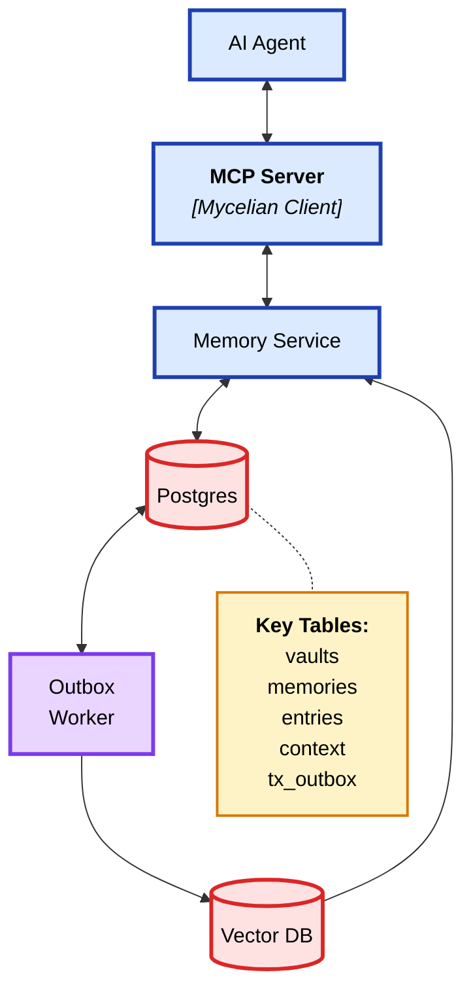

<div align="center">
  
  
  # Mycelian Memory
  
  Mycelian Memory is an open source framework that aims to provide simple, reliable and cost-effective long-term memory and context to AI Agents.
  
  [](https://github.com/mycelian/mycelian-memory/stargazers)
  [](https://github.com/mycelian/mycelian-memory/blob/sameerch-dev/client/LICENSE)
  [](https://github.com/mycelian/mycelian-memory/tree/sameerch-dev)
  [](https://discord.gg/mEqsYcDcAj)
  [](https://github.com/mycelian/mycelian-memory/issues)
  [](https://github.com/mycelian/mycelian-memory/pulls)
</div>

### Why Mycelian

Mycelian aims to provide AI agents with persistent memory through a simple, reliable, log‑structured architecture.

When an agent interacts with users, it builds deep contextual understanding within a session, but forgets everything when the session ends. Mycelian provides a framework for agents to directly persist their working context and memories, capturing high‑fidelity information as they process it during conversations.

The framework organizes information in immutable timelines that preserve memory and context fidelity, enabling high precision recall without expensive inference costs during retrieval. Users maintain full control over their memory data, including deletions and corrections. 

The architecture is inspired by distributed systems principles, treating memory as an append‑only log that accumulates knowledge over time rather than constantly mutating core state. To learn more about the architecture, see [our architecture document](docs/designs/001_mycelian_memory_architecture.md). 

#### What It Does Today

- **Stores agent memory** via append‑only high fidelity entry logs paired with context snapshots (context shards)
- **Organizes knowledge** through vault‑based scoping
- **Retrieves context** using hybrid search across memory entries and context shards
- **Maintains fidelity** by avoiding lossy summarization chains and graph-based memory complexity
- **Runs locally but designed to run anywhere** with self‑hostable Go backend and pluggable storage/vector database support.
- **Tested for memory recall** using the MemGPT/MSC-Self-Instruct benchmark dataset (see `tools/benchmarker/`)


🚨 🚧 🏗️ *This project is under active development and not yet production‑ready.*

### Is Mycelian inspired from Mycelium? - Yes :)

In nature, mycelium creates vast underground networks connecting trees, allowing them to exchange nutrients, communicate, manage resources, and maintain ecosystem resilience.

Mycelian takes inspiration from this natural interconnectedness for AI agents. The aim to build core AI primitives, starting with long-term AI memory and context management, that enable intelligent systems to work seamlessly together, enhancing their capabilities and reliability.

---

### Quickstart (Docker)

Prereqs (please refer to [CONTRIBUTING.md](CONTRIBUTING.md)): 
1. Docker Desktop 
2. Ollama
3. Make & jq

```bash
# 1) Start Ollama (separate terminal)
brew install ollama   # macOS
ollama serve &
ollama pull nomic-embed-text

# 2) Start the backend stack (Postgres, Weaviate, Memory Service)
make start-dev-mycelian-server

# 3) Wait for healthy and verify
curl -s http://localhost:11545/v0/health | jq
```

The stack exposes the API on `http://localhost:11545`.

---

### Quickstart (MCP Integration)

#### For tools that support Streamable MCP Server (Cursor)

```bash
# Start the MCP server
make start-mcp-streamable-server
```

**Add to Cursor MCP config** (`~/.cursor/mcp.json`):

```json
{
  "mcpServers": {
    "mycelian-memory-streamable": {
      "url": "http://localhost:11546/mcp",
      "alwaysAllow": [
        "add_entry",
        "list_entries", 
        "create_vault",
        "list_vaults",
        "list_memories",
        "get_memory",
        "create_memory_in_vault",
        "put_context",
        "get_context",
        "search_memories",
        "await_consistency"
      ]
    }
  }
}
```
#### For tools that require stdio mode (Claude Desktop)

```bash
# Build the MCP server binary
make build-mcp-server
```

**Add to Claude Desktop config** (`~/Library/Application Support/Claude/claude_desktop_config.json` on macOS):

```json
{
  "mcpServers": {
    "mycelian-memory": {
      "command": "/path/to/mycelian-memory/bin/mycelian-mcp-server",
      "env": {
        "MEMORY_SERVICE_URL": "http://localhost:11545"
      }
    }
  }
}
```

#### Usage in both IDEs:
- Create vaults and memories for your projects
- Store context, code snippets, and project knowledge  
- Search across your stored memories during development
- Maintain persistent context between coding sessions

The MCP server provides tools for vault management, memory operations, context storage, and search.

---

### API overview

Base URL: `http://localhost:11545/v0`

```bash
# Set dev mode API key for local development
export API_KEY="LOCAL_DEV_MODE_NOT_FOR_PRODUCTION"
export MCP_PORT="11546"

# Health (no auth required)
curl -s http://localhost:11545/v0/health

# Create a vault
curl -s -X POST http://localhost:11545/v0/vaults \
  -H "Authorization: Bearer $API_KEY" \
  -H "Content-Type: application/json" \
  -d '{"title":"notes"}'

# Create a memory inside a vault
curl -s -X POST http://localhost:11545/v0/vaults/<vaultId>/memories \
  -H "Authorization: Bearer $API_KEY" \
  -H "Content-Type: application/json" \
  -d '{"title":"demo","memoryType":"NOTES"}'

# Put and get context (plain text)
curl -s -X PUT http://localhost:11545/v0/vaults/<vaultId>/memories/<memoryId>/contexts \
  -H "Authorization: Bearer $API_KEY" \
  -H "Content-Type: text/plain; charset=utf-8" \
  --data-binary @context.txt

curl -s http://localhost:11545/v0/vaults/<vaultId>/memories/<memoryId>/contexts \
  -H "Authorization: Bearer $API_KEY" -H "Accept: text/plain"

# Search (requires index + embeddings to be healthy)
curl -s -X POST http://localhost:11545/v0/search \
  -H "Authorization: Bearer $API_KEY" \
  -H "Content-Type: application/json" \
  -d '{"query":"hello", "limit":10}'
```

Auth: development mode accepts a single dev API key. Use the Go SDK helper `client.NewWithDevMode(...)` during local development instead of pasting keys.

---

### Configuration (environment)

All server configuration uses the `MEMORY_SERVER_` prefix. Useful vars:

- `MEMORY_SERVER_HTTP_PORT` (default `11545`)
- `MEMORY_SERVER_BUILD_TARGET` (`cloud-dev` by default)
- `MEMORY_SERVER_DEV_MODE` (`true|false`)
- `MEMORY_SERVER_POSTGRES_DSN` (Postgres connection string)
- `MEMORY_SERVER_SEARCH_INDEX_URL` (Weaviate host, e.g. `weaviate:8080`)
- `MEMORY_SERVER_EMBED_PROVIDER` (default `ollama`)
- `MEMORY_SERVER_EMBED_MODEL` (default `nomic-embed-text`)
- `MEMORY_SERVER_HEALTH_INTERVAL_SECONDS` (default `30`)
- `MEMORY_SERVER_HEALTH_PROBE_TIMEOUT_SECONDS` (default `2`)
- `MEMORY_SERVER_MAX_CONTEXT_CHARS` (default `65536`)
- `OLLAMA_URL` (default `http://localhost:11434`)

See `server/internal/config/config.go` for defaults and descriptions. Docker compose examples live in `deployments/docker/`.

---

### Repository layout

```text
cmd/
  memory-service/         # HTTP API server
  mycelian-mcp-server/    # MCP server (stdio/HTTP)
client/                   # Go SDK (typed, minimal surface)
server/                   # Service code, internal packages, Makefile
deployments/docker/       # Compose files for local/dev
tools/                    # CLI and service tools
docs/                     # ADRs, designs, API reference
```

For detailed information about the monorepo structure, versioning, and development workflow, see [docs/monorepo.md](docs/monorepo.md).

---

### Architecture (high level)




---

### Contributing

See [CONTRIBUTING.md](CONTRIBUTING.md) for complete development setup, workflow, and contribution guidelines.

