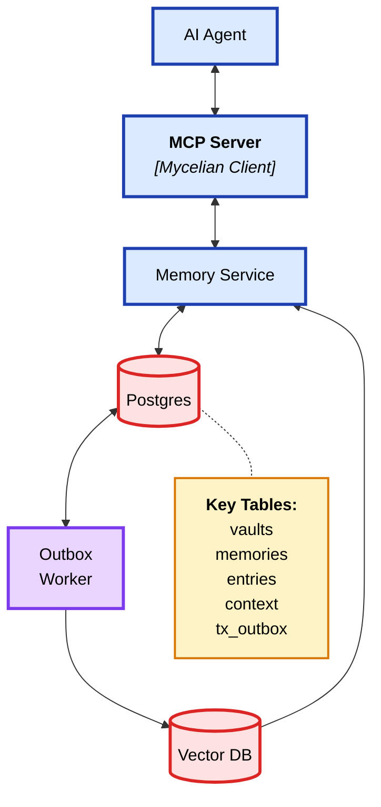

<div align="center">
  

  # Mycelian Memory

  Mycelian Memory is an open source framework that aims to provide simple, reliable, and cost-effective long-term memory and context to AI Agents.

  [](https://github.com/mycelian-ai/mycelian-memory/stargazers)
  [](https://github.com/mycelian-ai/mycelian-memory/blob/main/LICENSE)
  [](https://github.com/mycelian-ai/mycelian-memory)
  [](https://discord.gg/mEqsYcDcAj)
  [](https://www.youtube.com/playlist?list=PL45CL__T1vQjpWUHB8yqWq3F_PEYh7LBK)
</div>

---

<div align="center">

[](https://www.youtube.com/watch?v=Hb6zQgh6ZdU)

*Click the image above to watch a demo of Mycelian Memory in action.*

**More Videos:** Check out the [Mycelian Memory YouTube Playlist](https://www.youtube.com/playlist?list=PL45CL__T1vQjpWUHB8yqWq3F_PEYh7LBK) for tutorials, demos, and deep dives.

</div>

---

## Why Mycelian

Mycelian aims to provide AI agents with persistent memory through a simple, reliable, log‑structured architecture.

When an agent interacts with users, it builds deep contextual understanding within a session, but forgets everything when the session ends. Mycelian provides a framework for agents to directly persist their working context and memories, capturing high‑fidelity information as they process it during conversations.

The framework organizes information in immutable timelines that preserve memory and context fidelity, enabling high precision recall without expensive inference costs during retrieval. Users maintain full control over their memory data, including deletions and corrections.

The architecture is inspired by distributed systems principles, treating memory as an append‑only log that accumulates knowledge over time rather than constantly mutating core state. To learn more about the architecture, see [the architecture document](docs/designs/001_mycelian_memory_architecture.md).

GitHub Hackday 2025: [Project Presentation and Demo](https://youtu.be/3UptmBLvU-c)

### Architecture (high-level design)

NOTE: The architecture now also supports Observer Agent based memory ingestion. I developed it as a part of developing the LongMemEval benchmarker using LangGraph. Will take an AI to create a cookbook for integrating Mycelian with LangGraph agents. 


```mermaid
flowchart TD
    Agent[AI Agent] <--> MCP["`**MCP Server**
    _[Mycelian Client]_`"]
    MCP <--> Service[Memory Service]
    Service <--> Postgres[(Postgres)]
    Vector[(Vector DB)] --> Service
    Postgres <--> Worker[Outbox<br/>Worker]
    Worker --> Vector

    %% Add label to Postgres
    Postgres -.- Tables["`**Key Tables:**
    vaults
    memories
    entries
    context
    tx_outbox`"]

    classDef primary fill:#dbeafe,stroke:#1e40af,stroke-width:3px,color:#000
    classDef storage fill:#fee2e2,stroke:#dc2626,stroke-width:3px,color:#000
    classDef async fill:#e9d5ff,stroke:#7c3aed,stroke-width:3px,color:#000
    classDef note fill:#fef3c7,stroke:#d97706,stroke-width:2px,color:#000

    class Agent,MCP,Service primary
    class Postgres,Vector storage
    class Worker async
    class Tables note
```


#### What It Does Today

- **Stores agent memory** via append‑only high fidelity entry logs paired with context snapshots (context shards)
- **Organizes knowledge** through vault‑based scoping
- **Retrieves context** using hybrid search across memory entries and context shards
- **Maintains fidelity** by avoiding lossy summarization chains and graph-based memory complexity
- **Runs locally but designed to run anywhere** with self‑hostable Go backend and pluggable storage/vector database support.
- **Supports ingestion of past recorded conversations**, which will be useful during onboarding an existing agent to Mycelian.
- **Tunned using [LongMemEval](https://github.com/xiaowu0162/LongMemEval/tree/main) benchmark** However, I must warn my fellow developers to not make the decision of memory product purely based on performance on an industry benchmark. What matters is the performance on your usecase.

### Is Mycelian inspired by Mycelium? - Yes :)

In nature, mycelium creates vast underground networks connecting trees, allowing them to exchange nutrients, communicate, manage resources, and maintain ecosystem resilience.

Mycelian takes inspiration from this natural interconnectedness for AI agents. The aim is to build core AI primitives, starting with long-term AI memory and context management, that enable intelligent systems to work seamlessly together, enhancing their capabilities and reliability.

---

## Disclaimer

🚨 🚧 🏗️ **This project is under active development and not yet production‑ready.**

🤖 **AI-Assisted Development**: I (@sam33rch) have created this codebase using AI development tools, specifically **Cursor**, **Claude Code**, and **Codex**. Part of the motivation is learning to build production-level code with AI while exploring what techniques work best.

As of 09-25-2025, I worked on problem disambiguation, architecture, specs, designs and provided oversight to the models for producing functional and good quality code. I did one quick pass and one round of tune-ups to get it ready for this early open source release to gather developer feedback. 

 Majority of the code was written by o3 and gpt5-high models, followed by Claude Opus 4.1
📚 **Learning Journey**: This is my first Go project, so I'm learning idiomatic Go patterns as I build. The code is functional but far from perfect, I'm currently focused on improving reliability. I invite the Gopher community to help make this project better through feedback, contributions, and guidance.

You'll find detailed AI development methodologies and techniques that have worked well documented in [docs/coding-stds/ai-coding-best-practices.md](docs/coding-stds/ai-coding-best-practices.md), and I'll continue updating these insights as the project evolves.

---

## Quickstart

### Server Setup

Prerequisites (please refer to [CONTRIBUTING.md](CONTRIBUTING.md)):
1. Docker Desktop
2. Ollama
3. Make & jq

```bash
# 1) Start Ollama (separate terminal)
brew install ollama   # macOS
ollama serve &
ollama pull nomic-embed-text

# 2) Start the backend stack (Postgres, Weaviate, Memory Service)
make start-dev-mycelian-server

# 3) Wait for healthy and verify
curl -s http://localhost:11545/v0/health | jq
```

The stack exposes the API on `http://localhost:11545`.

---

### Ports

| Service | Port | Notes |
| --- | --- | --- |
| MCP server | 11546 | Streamable HTTP endpoint at `/mcp` |
| Memory service (HTTP API) | 11545 | Base URL `http://localhost:11545` |
| Database (Postgres, dev) | 11544 | Host port mapped to container `5432` |
| Vector DB (Weaviate, dev) | 11543 | Host port mapped to container `8080` |

These are authoritative host ports for local/dev. Other databases or vector stores can be used, but should respect these host port assignments for consistency.

---

### MCP Server Configuration

#### For tools that support streamable MCP Servers (e.g. Cursor)

```bash
# Start the MCP server
make start-mcp-streamable-server
```

**Add to Cursor MCP config** (`~/.cursor/mcp.json`):

```json
{
  "mcpServers": {
    "mycelian-memory-streamable": {
      "url": "http://localhost:11546/mcp",
      "alwaysAllow": [
        "add_entry",
        "list_entries",
        "create_vault",
        "list_vaults",
        "list_memories",
        "get_memory",
        "create_memory_in_vault",
        "put_context",
        "get_context",
        "search_memories",
        "await_consistency"
      ]
    }
  }
}
```

#### For tools that require stdio mode (e.g. Claude Desktop)

```bash
# Build the MCP server binary
make build-mcp-server
```

**Add to Claude Desktop config** (`~/Library/Application Support/Claude/claude_desktop_config.json` on macOS):

```json
{
  "mcpServers": {
    "mycelian-memory": {
      "command": "/path/to/mycelian-memory/bin/mycelian-mcp-server",
      "env": {
        "MEMORY_SERVICE_URL": "http://localhost:11545"
      }
    }
  }
}
```


---

## API overview

Base URL: `http://localhost:11545/v0`

```bash
# Set dev mode API key for local development
export API_KEY="LOCAL_DEV_MODE_NOT_FOR_PRODUCTION"  # pragma: allowlist secret
export MCP_PORT="11546"

# Health (no auth required)
curl -s http://localhost:11545/v0/health

# Create a vault
curl -s -X POST http://localhost:11545/v0/vaults \
  -H "Authorization: Bearer $API_KEY" \
  -H "Content-Type: application/json" \
  -d '{"title":"notes"}'

# Create a memory inside a vault
curl -s -X POST http://localhost:11545/v0/vaults/<vaultId>/memories \
  -H "Authorization: Bearer $API_KEY" \
  -H "Content-Type: application/json" \
  -d '{"title":"demo","memoryType":"NOTES"}'

# Put and get context (plain text)
curl -s -X PUT http://localhost:11545/v0/vaults/<vaultId>/memories/<memoryId>/contexts \
  -H "Authorization: Bearer $API_KEY" \
  -H "Content-Type: text/plain; charset=utf-8" \
  --data-binary @context.txt

curl -s http://localhost:11545/v0/vaults/<vaultId>/memories/<memoryId>/contexts \
  -H "Authorization: Bearer $API_KEY" -H "Accept: text/plain"

# Search (requires index + embeddings to be healthy)
curl -s -X POST http://localhost:11545/v0/search \
  -H "Authorization: Bearer $API_KEY" \
  -H "Content-Type: application/json" \
  -d '{"query":"hello", "limit":10}'
```

Auth: development mode accepts a single dev API key. Use the Go SDK helper `client.NewWithDevMode(...)` during local development instead of pasting keys.

---

## Configuration (environment)

All server configuration uses the `MEMORY_SERVER_` prefix. Useful vars:

- `MEMORY_SERVER_HTTP_PORT` (default `11545`)
- `MEMORY_SERVER_BUILD_TARGET` (`cloud-dev` by default)
- `MEMORY_SERVER_DEV_MODE` (`true|false`)
- `MEMORY_SERVER_POSTGRES_DSN` (Postgres connection string)
- `MEMORY_SERVER_SEARCH_INDEX_URL` (Weaviate host, e.g. `weaviate:8080`)
- `MEMORY_SERVER_EMBED_PROVIDER` (default `ollama`)
- `MEMORY_SERVER_EMBED_MODEL` (default `nomic-embed-text`)
- `MEMORY_SERVER_HEALTH_INTERVAL_SECONDS` (default `30`)
- `MEMORY_SERVER_HEALTH_PROBE_TIMEOUT_SECONDS` (default `2`)
- `MEMORY_SERVER_MAX_CONTEXT_CHARS` (default `65536`)
- `OLLAMA_URL` (default `http://localhost:11434`)

See `server/internal/config/config.go` for defaults and descriptions. Docker compose examples live in `deployments/docker/`.

---

## Repository layout

```text
cmd/
  memory-service/         # HTTP API server
  mycelian-mcp-server/    # MCP server (stdio/HTTP)
client/                   # Go SDK (typed, minimal surface)
server/                   # Service code, internal packages, Makefile
deployments/docker/       # Compose files for local/dev
tools/                    # CLI and service tools
docs/                     # ADRs, designs, API reference
```

For detailed information about the monorepo structure, versioning, and development workflow, see [docs/monorepo.md](docs/monorepo.md).

---

## Contributing

See [CONTRIBUTING.md](CONTRIBUTING.md) for complete development setup, workflow, and contribution guidelines. Day-to-day coding expectations and command references live in [AGENTS.md](AGENTS.md).

---

## License
Apache 2.0 — see the [LICENSE](LICENSE) file for details.

---

## Star History

[](https://star-history.com/#mycelian-ai/mycelian-memory&Date)
