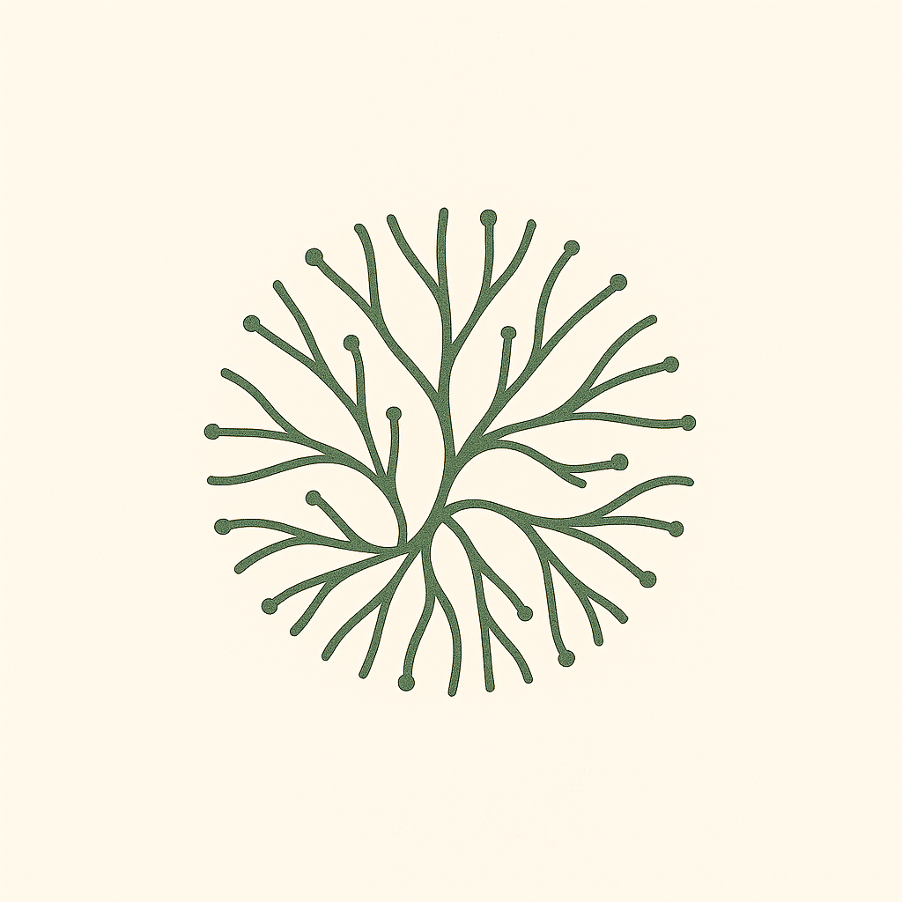

<div align="center">
  
  
  # Mycelian Memory
  
  Mycelian Memory is an open source project for providing simple, reliable and cost-effective long-term memory and context to AI Agents.
  
  [](https://github.com/mycelian/mycelian-memory/stargazers)
  [](https://github.com/mycelian/mycelian-memory/blob/sameerch-dev/client/LICENSE)
  [](https://github.com/mycelian/mycelian-memory/tree/sameerch-dev)
  [](https://discord.gg/mEqsYcDcAj)
  [](https://github.com/mycelian/mycelian-memory/issues)
  [](https://github.com/mycelian/mycelian-memory/pulls)
</div>

### Why Mycelian

Mycelian aims* to provide AI agents with persistent memory through a simple, log‑structured architecture.

When an agent interacts with users, it builds deep contextual understanding, but loses everything when the session ends. Mycelian provides a protocol for agents to directly persist their working context, capturing high‑fidelity information as they process it naturally during conversations.

(*emphasis on aims)

#### What It Does Today

- **Stores agent memory** via append‑only high fidelity entry logs paired with context snapshots (context shards)
- **Organizes knowledge** through vault‑based scoping
- **Retrieves context** using hybrid search across memory entries and context shards
- **Maintains fidelity** by avoiding lossy summarization chains
- **Runs anywhere** with self‑hostable Go backend and Postgres storage

The architecture is inspired by distributed systems principles — treating memory as an append‑only log that accumulates knowledge over time rather than constantly rewriting state. To learn more about the design, see [our architecture document](docs/designs/001_mycelian_memory_architecture.md).

🚨 🚧 🏗️ *This project is under active development and not yet production‑ready.*


### Is Mycleian inspired from Mycelium? - Yes :)

In nature, mycelium creates vast underground networks connecting trees, allowing them to exchange nutrients, communicate, manage resources, and maintain ecosystem resilience.

Mycelian's takes inspiration from this natural interconnectedness for AI agents. We aim to build core AI primitives, starting with long-term AI memory and context management, that enable intelligent systems to work seamlessly together, enhancing their capabilities and reliability.

---

### Quickstart (Docker)

Prereqs: Docker Desktop. For embeddings, run Ollama locally and pull the model used by default.

```bash
# 1) Start Ollama (separate terminal)
brew install ollama   # macOS
ollama serve &
ollama pull nomic-embed-text

# 2) Start the backend stack (Postgres, Weaviate, Memory Service)
make start-dev-mycelian-server

# 3) Wait for healthy and verify
curl -s http://localhost:11545/v0/health | jq
```

The stack exposes the API on `http://localhost:11545`.

---

### Quickstart (Go SDK)

```go
package main

import (
    "context"
    "fmt"
    "github.com/mycelian/mycelian-memory/client"
)

func main() {
    // Dev-only helper automatically uses the local development API key.
    c, err := client.NewWithDevMode("http://localhost:11545")
    if err != nil { panic(err) }
    defer c.Close()

    ctx := context.Background()

    v, err := c.CreateVault(ctx, client.CreateVaultRequest{Title: "notes"})
    if err != nil { panic(err) }
    m, err := c.CreateMemory(ctx, v.VaultID, client.CreateMemoryRequest{Title: "demo", MemoryType: "NOTES"})
    if err != nil { panic(err) }

    // Optional: attach context text and add an entry
    _, _ = c.PutContext(ctx, v.VaultID, m.ID, "projectBrief:...\nactiveContext:...\n")
    _, _ = c.AddEntry(ctx, v.VaultID, m.ID, client.AddEntryRequest{RawEntry: "hello", Summary: "greeting"})

    // Read back
    list, _ := c.ListEntries(ctx, v.VaultID, m.ID, nil)
    fmt.Println("entries:", list.Count)
}
```

---

### Quickstart (MCP server)

Run the MCP server in HTTP mode (good for Cursor) or stdio (good for Claude Desktop). The server forwards all operations through the Go SDK.

```bash
# Option A: Docker (HTTP, port 11546)
make start-mcp-streamable-server

# Option B: Local binary (HTTP, port 11546)
cd cmd/mycelian-mcp-server
go build -o mycelian-mcp-server .
MCP_HTTP=true MEMORY_SERVICE_URL=http://localhost:11545 ./mycelian-mcp-server

# Sanity check (expect 200)
curl -m 2 -s -o /dev/null -w "%{http_code}\n" http://localhost:11546/mcp
```

In Cursor, add a custom MCP server pointing to `http://localhost:11546/mcp`.

---

### API overview

Base URL: `http://localhost:11545/v0`

```bash
# Health
curl -s http://localhost:11545/v0/health

# Create a vault (Authorization required; use a Bearer token)
curl -s -X POST http://localhost:11545/v0/vaults \
  -H "Authorization: Bearer <your_api_key>" \
  -H "Content-Type: application/json" \
  -d '{"title":"notes"}'

# Create a memory inside a vault
curl -s -X POST http://localhost:11545/v0/vaults/<vaultId>/memories \
  -H "Authorization: Bearer <your_api_key>" \
  -H "Content-Type: application/json" \
  -d '{"title":"demo","memoryType":"NOTES"}'

# Put and get context (plain text)
curl -s -X PUT http://localhost:11545/v0/vaults/<vaultId>/memories/<memoryId>/contexts \
  -H "Authorization: Bearer <your_api_key>" \
  -H "Content-Type: text/plain; charset=utf-8" \
  --data-binary @context.txt

curl -s http://localhost:11545/v0/vaults/<vaultId>/memories/<memoryId>/contexts \
  -H "Authorization: Bearer <your_api_key>" -H "Accept: text/plain"

# Search (requires index + embeddings to be healthy)
curl -s -X POST http://localhost:11545/v0/search \
  -H "Authorization: Bearer <your_api_key>" \
  -H "Content-Type: application/json" \
  -d '{"query":"hello", "limit":10}'
```

Auth: development mode accepts a single dev API key. Use the Go SDK helper `client.NewWithDevMode(...)` during local development instead of pasting keys.

---

### Configuration (environment)

All server configuration uses the `MEMORY_SERVER_` prefix. Useful vars:

- `MEMORY_SERVER_HTTP_PORT` (default `11545`)
- `MEMORY_SERVER_BUILD_TARGET` (`cloud-dev` by default)
- `MEMORY_SERVER_DEV_MODE` (`true|false`)
- `MEMORY_SERVER_POSTGRES_DSN` (Postgres connection string)
- `MEMORY_SERVER_SEARCH_INDEX_URL` (Weaviate host, e.g. `weaviate:8080`)
- `MEMORY_SERVER_EMBED_PROVIDER` (default `ollama`)
- `MEMORY_SERVER_EMBED_MODEL` (default `nomic-embed-text`)
- `MEMORY_SERVER_HEALTH_INTERVAL_SECONDS` (default `30`)
- `MEMORY_SERVER_HEALTH_PROBE_TIMEOUT_SECONDS` (default `2`)
- `MEMORY_SERVER_MAX_CONTEXT_CHARS` (default `65536`)
- `OLLAMA_URL` (default `http://localhost:11434`)

See `server/internal/config/config.go` for defaults and descriptions. Docker compose examples live in `deployments/docker/`.

---

### Repository layout

```text
cmd/
  memory-service/         # HTTP API server
  mycelian-mcp-server/    # MCP server (stdio/HTTP)
client/                   # Go SDK (typed, minimal surface)
server/                   # Service code, internal packages, Makefile
deployments/docker/       # Compose files for local/dev
tools/                    # CLI and service tools
docs/                     # ADRs, designs, API reference
```

---

### Architecture (high level)

```mermaid
flowchart LR
  A[IDE/LLM] -->|MCP| B[Mycelian MCP server]
  B -->|Go SDK| C[Memory Service HTTP]
  C --> D[(Postgres)]
  C --> E[Vector Index\n(Weaviate)]
  C --> F[Embeddings\n(Ollama)]
```

---

### Troubleshooting

- Health stays "unhealthy": ensure Postgres, Weaviate, and Ollama are up; check `docker compose` logs. The service waits for healthy deps before serving.
- Search errors: verify Weaviate is reachable (port `8082->8080`) and that Ollama is running with the `nomic-embed-text` model pulled.
- Auth 401: in dev, prefer the SDK’s `NewWithDevMode` to set the Authorization header for you.

---

### Contributing

Requirements: Go 1.24.6+. Before opening a PR, run:

```bash
go fmt ./... && go vet ./... && go test -race ./... && go tool golangci-lint run
```

Common local tasks:

```bash
make build
make start-dev-mycelian-server
```

---

### License

See `LICENSE`.

Need to create a simple README file