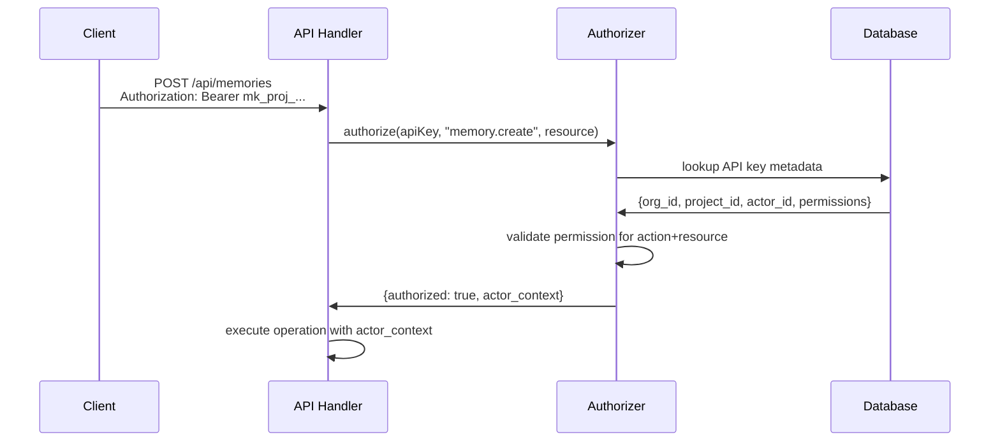

# ADR-012: API Key-Based Authorization

**Status**: Accepted  
**Date**: 2025-08-11

## Context

Following ADR-011's introduction of hierarchical memory scoping (`org_id`, `project_id`, `vault_id`) and actor-based identity, we need a secure and scalable authorization mechanism. The current approach of passing `actor_id` explicitly in API calls creates security risks and implementation complexity.

Current challenges:
- Clients must explicitly pass `actor_id`, creating opportunity for impersonation
- No centralized authorization logic for action-resource permission checks
- Difficulty in tracking and rotating access credentials
- Complex permission validation scattered across API handlers
- Risk of privilege escalation through parameter manipulation

## Decision

### 1. API Key as Identity and Authorization Token

API keys serve as both authentication and authorization mechanism:
- Each API key encodes `(org_id, project_id, actor_id, permissions)`
- **Functions as a true bearer token**: Possession of the key grants access without additional authentication
- Backend authorizer extracts actor context from API key
- No explicit `actor_id` parameter needed in API calls

### 2. API Key Structure

Use structured API key format:
```
mk_proj_{org_slug}_{project_slug}_{actor_slug}_{random_suffix}
Example: mk_proj_acme_support_agent_summarizer_v2_abc123def456
```

### 3. Authorization Flow



### 4. Authorizer Interface

```go
type Authorizer interface {
    Authorize(ctx context.Context, apiKey string, action string, resource Resource) (*ActorContext, error)
}

type ActorContext struct {
    ActorID   string `json:"actorId"`
    OrgID     string `json:"orgId"`
    ProjectID string `json:"projectId"`
    Permissions []string `json:"permissions"`
}

type Resource struct {
    Type     string `json:"type"`     // "memory", "vault", "entry"
    OrgID    string `json:"orgId"`
    ProjectID string `json:"projectId"`
    VaultID  *string `json:"vaultId,omitempty"`
    MemoryID *string `json:"memoryId,omitempty"`
}
```

### 5. Permission Model

**Actions**:
- `memory.create`, `memory.read`, `memory.update`, `memory.delete`
- `entry.create`, `entry.read`, `entry.update`, `entry.delete`
- `context.create`, `context.read`, `context.update`
- `vault.create`, `vault.read`, `vault.update`, `vault.delete`

**Permission Levels**:
- `read-only`: Can perform all `*.read` actions
- `read-write`: Can perform all actions within project scope
- `admin`: Can perform all actions + manage API keys

### 6. API Key Storage

Store API key metadata securely:
```sql
CREATE TABLE api_keys (
    key_id UUID PRIMARY KEY,
    key_hash VARCHAR(64) NOT NULL, -- SHA-256 of full API key
    org_id VARCHAR(50) NOT NULL,
    project_id VARCHAR(50) NOT NULL,
    actor_id VARCHAR(100) NOT NULL,
    permissions TEXT[] NOT NULL,
    created_at TIMESTAMP DEFAULT NOW(),
    expires_at TIMESTAMP,
    last_used_at TIMESTAMP,
    is_active BOOLEAN DEFAULT TRUE
);
```

## Consequences

### Positive Consequences
- **Enhanced Security**: No client-side actor identity manipulation possible
- **Simplified APIs**: Client calls don't require explicit `actor_id` parameter
- **Centralized Authorization**: Single point for all permission logic
- **Audit Trail**: All actions automatically linked to authenticated actor
- **Key Rotation**: Easy to revoke/rotate keys without changing client code
- **Scalable Permissions**: Fine-grained action-resource permission model

### Negative Consequences
- **Key Management Overhead**: Organizations must manage multiple API keys per project
- **Performance Impact**: Authorization lookup on every API call
- **Single Point of Failure**: Authorizer must be highly available
- **Key Discovery**: Clients need mechanism to obtain appropriate API keys

## Implementation Notes

### API Handler Integration
```go
func (h *MemoryHandler) CreateMemory(w http.ResponseWriter, r *http.Request) {
    apiKey, err := auth.ExtractAPIKey(r)
    if err != nil {
        respond.WriteError(w, http.StatusUnauthorized, "Missing API key")
        return
    }

    resource := auth.Resource{
        Type: "memory",
        OrgID: mux.Vars(r)["orgId"],
        ProjectID: mux.Vars(r)["projectId"],
    }

    actorCtx, err := h.authorizer.Authorize(r.Context(), apiKey, "memory.create", resource)
    if err != nil {
        respond.WriteError(w, http.StatusForbidden, "Unauthorized")
        return
    }

    // Use actorCtx.ActorID for business logic
    memory, err := h.service.CreateMemory(r.Context(), CreateMemoryRequest{
        ActorID: actorCtx.ActorID,
        OrgID: actorCtx.OrgID,
        ProjectID: actorCtx.ProjectID,
        // ... other fields
    })
}
```

### Caching Strategy
- Cache API key lookups with TTL (e.g., 5 minutes)
- Invalidate cache on key rotation/revocation
- Use distributed cache (Redis) for multi-instance deployments

### Key Provisioning
- Admin API for creating/managing project API keys
- Self-service portal for project managers
- Integration with external identity providers (OAuth2, SAML)

## Security Considerations

### API Key Protection
- **Bearer token security**: Keys grant access to whoever possesses them
- Keys transmitted only over HTTPS
- Store only hashed versions in database
- Implement rate limiting per key
- Monitor for suspicious usage patterns
- Treat keys as sensitive credentials requiring secure storage by clients

### Permission Validation
- Always validate org/project scope matches API key
- Prevent cross-project data access
- Log all authorization decisions for audit

### Key Rotation
- Support overlapping validity periods during rotation
- Automated expiration warnings
- Emergency revocation capability

## Alternatives Considered

### Alternative 1: JWT-Based Tokens
**Description**: Use signed JWT tokens containing actor/permission claims  
**Why rejected**: Stateless tokens harder to revoke; key rotation complexity

### Alternative 2: OAuth 2.0 / OpenID Connect
**Description**: Full OAuth flow with external identity provider  
**Why rejected**: Over-engineering for API-to-API authentication; adds latency

### Alternative 3: Mutual TLS (mTLS)
**Description**: Certificate-based authentication  
**Why rejected**: Complex certificate management; doesn't solve authorization

## Migration Plan

1. **Implement Authorizer**: Build authorization service and database schema
2. **Update API Handlers**: Integrate authorization checks in all endpoints
3. **Generate Migration Keys**: Create API keys for existing actors/projects
4. **Update Client SDKs**: Remove explicit `actor_id` parameters
5. **Deprecate Legacy Auth**: Phase out old authentication methods
