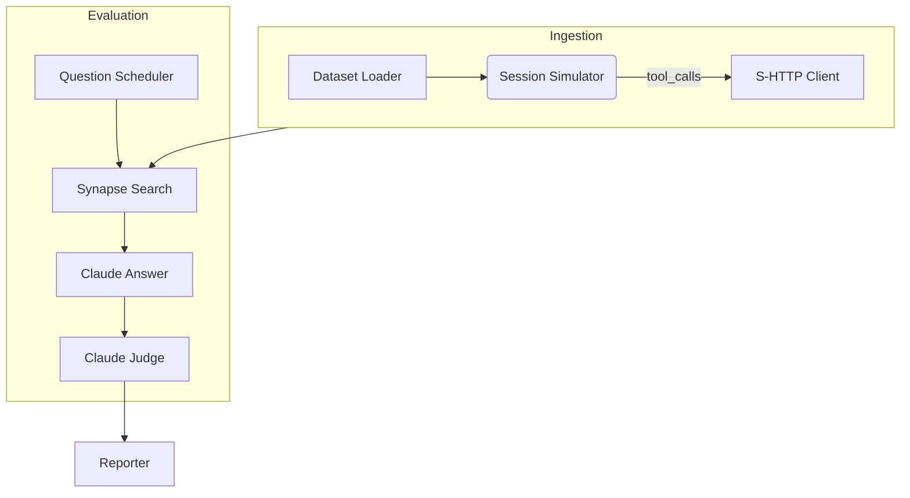
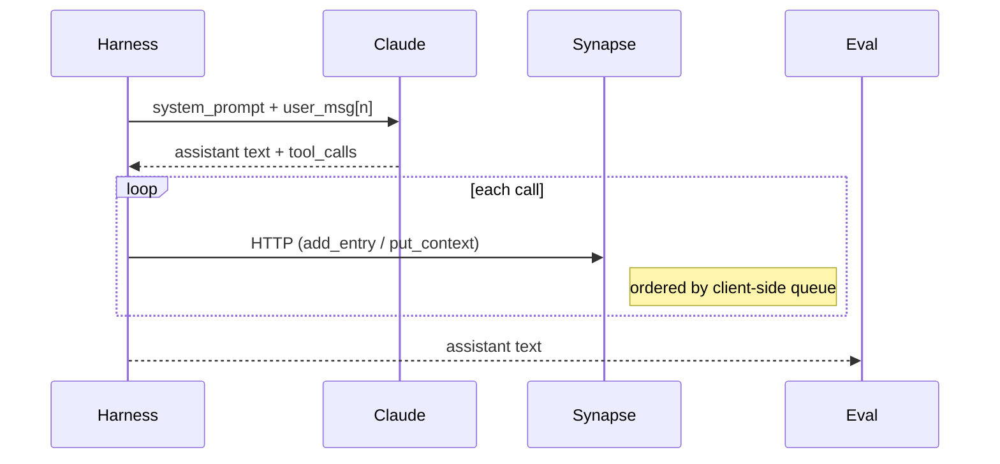

# Benchmark Harness – Design Overview

*Status: draft – 2025-07-03*

## 1. Purpose
Provide a reproducible, configurable framework that:
* **Authoritatively evaluates** Synapse long-term-memory via a single harness – **this replaces the deprecated manual DMR operator flow**.
* Ingests benchmark datasets (DMR, MSC-Self-Instruct, LongMemEval, LocoMoco…) into **Synapse** via a *real* LLM agent.
* Evaluates retrieval-based QA accuracy against Claude, MemGPT, Zep baselines.
* Reports metrics in an artefact suitable for trend tracking.

### Supported benchmarks (2025-07-07)
* MSC-Self-Instruct ✅
* Deep-Memory-Retrieval (DMR) ✅
* LongMemEval 🔜
* LocoMoco 🔜

## 2. Design Principles
1. **Fidelity over shortcuts** – The harness must use the *same* prompts, tool schema and write-ordering as production agents.
2. **Model-agnostic core** – Data loaders, prompt builders, and metric aggregation do **not** assume Anthropic specifics; model strategy is pluggable.
3. **Token-efficient session memory** – Sliding window + running summary keep each API call well under 8 k tokens.
4. **Deterministic runs** – Fixed random seeds, version-pinned dependencies (`requirements.txt`).
5. **Separation of concerns** –
   • *Ingestion* (chat replay + tool execution)
   • *Evaluation* (search + answer + judge)
   • *Reporting* (metrics, JSON dump)
6. **Incremental adoption** – First release supports Claude-3.5 Sonnet; adding GPT-4o or Mistral later requires only another strategy class and new API key.

## 3. High-Level Architecture


## 4. Key Components
| Component | Language | Responsibility |
|-----------|----------|----------------|
| PromptLoader | Python | Lazy load prompt files, cache in-memory |
| SessionSimulator | Python | Maintain `messages` history, send user turns, execute tool calls |
| SynapseMemoryClient | Python | Thin wrapper around create_memory, add_entry, put_context, search_memories, get_context, list_recent_entries |
| BenchmarkRunner | Python | Orchestrate dataset → ingestion → evaluation → metrics |
| ModelStrategy | Python ABC | `send(messages, tools) -> assistant_block`; first impl = AnthropicStrategy |

## 5. Session Flow


## 6. Configuration
```yaml
model:
  provider: anthropic
  name: claude-3-5-sonnet-20241022
  api_key_env: ANTHROPIC_API_KEY
benchmarks:
  - name: dmr
    dataset: datasets/dmr.json
    max_conversations: 500  # override via CLI flag
search:
  top_k: 5
window:
  recent_turns: 10
  summary_refresh: 6  # turns
```
CLI example:
```
python scripts/run_benchmark.py \
  --benchmark dmr \
  --anthropic-key $ANTHROPIC_API_KEY \
  --synapse-url http://localhost:8000 \
  --max-conversations 50
```

## 7. Token Budget
* Rules + context_prompt ≈ 3.5 k
* Context doc (≤ 5 k chars) ≈ 1.5 k
* 10 recent turns ≈ 1 k
* Overhead < 6.5 k ↝ safe for Claude-3-Sonnet (200 k limit)

## 8. Extensibility Hooks
* **ModelStrategy** – add `OpenAIStrategy`, `MistralStrategy` with the same `send()` contract.
* **Evaluator** – drop-in `search_memories` scorer can be replaced once we switch to Weaviate.
* **Dataset Loader** – register new loader in `BenchmarkDataLoader` enum.

## 9. Error Handling & Retries
| Failure | Mitigation |
|---------|------------|
| HTTP 5xx from Synapse | Exponential backoff (max 3x) |
| Anthropic rate-limit | `asyncio.sleep(retry_after)` header support |
| JSON parse errors in tool_calls | Fallback: log + skip turn |

## 10. CI / Automation
* `make bench-smoke` – stub Anthropic, run 2 conversations end-to-end.
* Nightly GitHub Action executes full benchmark (requires paid API key).
* Results are uploaded to `docs/benchmarks/results/<date>.json`.

## 11. Open Questions
1. Persist Claude cost per run? (Billing monitoring)
2. Auto-generate plots for accuracy trends?
3. Should harness push latency metrics to Prometheus? 

## Quick Start (local dev)
```bash
# 1. Create and activate Python virtual env
python3 -m venv venv
source venv/bin/activate

# 2. Install harness dependencies
pip install -r benchmarks/python/requirements.txt

# 3. Run smoke ingest (1 MSC conversation)
export ANTHROPIC_API_KEY=sk-…
python -m benchmarks.python.benchmark_runner \
  --synapse-url http://localhost:8080 \
  ingest \
  --conversations 1 \
  --tracker-file tracker.json
``` 

### Common CLI commands

| Task | Command |
|------|---------|
| Ingest only (create memories, no evaluation) | `python -m benchmarks.python.benchmark_runner --synapse-url http://localhost:8080 --conversations 10 --tracker-file tracker.json ingest` |
| Evaluate only (reuse tracker) | `python -m benchmarks.python.benchmark_runner --synapse-url http://localhost:8080 --tracker-file tracker.json --output results.json eval` |
| Ingest **and** evaluate (default) | `python -m benchmarks.python.benchmark_runner --synapse-url http://localhost:8080 --conversations 10 --output results.json both` |
| Tool-schema smoke test | `python -m benchmarks.python.benchmark_runner --synapse-url http://localhost:8080 validate-tools` |

**Note:** Global flags (`--synapse-url`, `--conversations`, `--tracker-file`, `--output`, `--anthropic-key`) **must appear before** the positional sub-command (`ingest`, `eval`, `both`, `validate-tools`). 