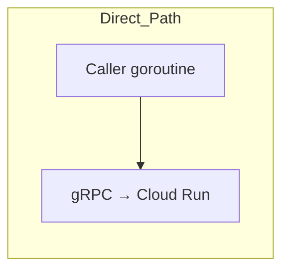

# Client Concurrency Model (MVP – Three Classes of APIs)

_Updated: 2025-06-19 – supersedes previous version after removal of SQLite mirror and adoption of Cloud-Run fan-out backend._

## 1. Overview
We divide all client-side operations into **three concurrency classes**:

| Class       | API Verbs                                                                                                                                | Ordering Guarantee                                                                                     | Execution Path                                                                               | Concurrency Limiter                                |
| ----------- | ---------------------------------------------------------------------------------------------------------------------------------------- | ------------------------------------------------------------------------------------------------------ | -------------------------------------------------------------------------------------------- | -------------------------------------------------- |
| **Ordered (SQ)** | `add_entry`, `delete_entry`, `put_context`, `await_consistency`                                            | FIFO **per memory**                                                                                    | Enqueued into **Sharded Queue (SQ)** → one of *N* worker goroutines (default **4**) | SQ worker count (configurable)                    |
| **Eventual Reads (Direct)** | `get_entry`, `list_entries`, `search_entries`, `get_context` | None (eventual) | Caller goroutine → direct gRPC/HTTP | Go runtime + gRPC multiplexing; optional semaphore |
| **Admin Strong (Direct)** | `create_user`, `create_memory`, `create_vault`, `delete_*`, `update_*`, `list_*` (metadata ops) | Strong (backend-enforced) | Caller goroutine → direct gRPC/HTTP | Go runtime + gRPC multiplexing |

### Why three classes?
* **Ordered verbs** require sequencing to preserve _read-your-write_ semantics per memory.
* **Eventual reads** can run in parallel with no consistency guarantees - users call `await_consistency()` explicitly when needed.
* **Admin operations** are strongly consistent but don't need per-memory ordering; backend autoscaling (Cloud Run + Spanner) absorbs the load.

## 2. Design Rationale

### 2.1 Ordered Path (SQ)
* **What**: Small, bounded worker pool (default 4) keyed by `hash(memoryID) % N`.
* **Why**: Guarantees that all writes and _consistent reads_ for the _same memory_ run after one another, eliminating race conditions without global locks.
* **Scalability**: Parallelism grows with the number of memories, not goroutines. Four workers easily sustain >1 000 writes/s on a laptop; increase `SQ_WORKERS` on beefier hosts.

```mermaid
flowchart LR
    subgraph Ordered_Path
        Call[Caller goroutine] --> Enq[SQ.enqueue(job)]
        Enq -->|FIFO| Worker[SQ worker (goroutine)]
        Worker --> gRPC[gRPC → Cloud Run]
    end
```

### 2.2 Direct Path (Unordered)
Direct path splits into two distinct concurrency classes:

1. **Eventual Reads (Direct)** – unqueued entry/context reads; may show write-lag across devices until `await_consistency()` called.
2. **Admin Strong (Direct)** – user, vault & memory CRUD / metadata operations; globally consistent once the call returns.

* **Execution**: Caller goroutine issues a unary gRPC (or HTTP) request immediately—no queue hop.
* **Consistency**: Eventual reads may lag; admin strong ops are committed atomically by Spanner and visible across all clients once the RPC completes.
* **Why no queue**: Neither subtype has a per-memory ordering dependency; adding a queue would only add latency.
* **Scalability**: Limited primarily by network bandwidth and backend quota. Go's scheduler handles tens of thousands of concurrent blocking RPC goroutines with negligible overhead.



#### 2.3  Per-client ordering vs. Mem0s

In **Synapse**, the Sharded Queue (SQ) makes a simple promise: _one client, one memory, one timeline_.  Every write you issue from the same process is placed on a small FIFO queue and sent only after the previous write has been **committed** by the backend.  This means your UI or agent will never see a newer note appear before an older one, even if your code fires requests in parallel or you go offline for a while—​the queue will retry in order once connectivity returns.

The Mem0s SDK, by contrast, trusts the database's _external consistency_ alone.  If an application fires two writes at the same time, whichever RPC finishes first wins the commit-timestamp race, so the order can flip.  In practice Mem0s tells developers to _avoid concurrent writes_ to the same record and to rely on eventual consistency for conflict resolution.

So the SQ doesn't try to beat Spanner's global ordering—it simply gives developers a **locally deterministic** sequence of events, making debugging, offline work, and mental models much saner while still letting Spanner arbitrate the combined history from multiple devices.

## 3. Back-Pressure & Limits

| Layer | Limiter | Default | When to Tune |
|-------|---------|---------|--------------|
| SQ | `SQ_WORKERS` env var | `4` | High write QPS per device (>1 000/s) |
| Direct Path | None (unbounded goroutines) | – | Mobile CPU / bandwidth constraints → add a `semaphore` |
| gRPC | `MAX_CONCURRENT_STREAMS` (server), flow control | Go default (2^31-1) | Rare; set lower if server needs to cap per-client streams |

## 4. Failure & Cancellation
* SQ wraps each job with retry / context cancellation; failure surfaces to caller.
* Direct calls rely on gRPC retries (idempotent) or bubble the error directly.

## 5. Why This Scales on the Client
1. **Minimal contention** – Only ordered operations funnel through four mutex-free worker goroutines; all reads are unblocked.
2. **Cheap goroutines** – Direct path uses Go's lightweight goroutines; 10 000 parked RPCs ≈ tens of MB RAM.
3. **Adaptive backend** – Cloud Run autoscales replicas; Spanner handles high connection concurrency. Client merely needs to issue requests.
4. **Configurable knobs** – Single env var (`SQ_WORKERS`) and optional read semaphore cover 99 % of tuning cases.

## 6. Assumptions About the Backend
* Backend exposes gRPC over HTTP/2, fronted by Cloud Run with auto-scaling.
* Spanner or Vertex AI latency per call dominates; horizontal scaling eliminates queuing on the server side.
* Idempotent reads / writes; retries are safe.

---
_This document intentionally omits local SQLite mirror considerations; see ADR-0018 for future plans._