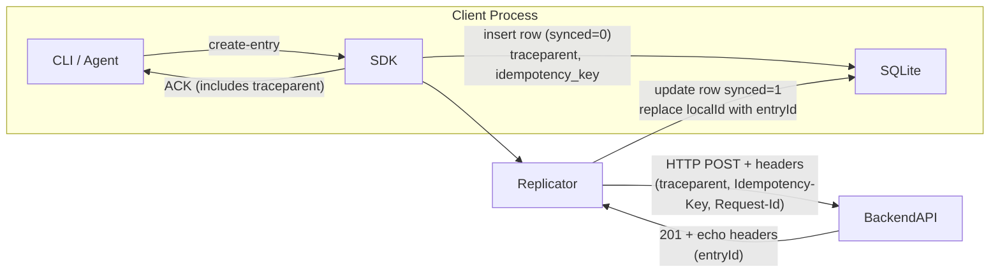

# ID Strategy & Observability Design

> Last updated: 2025-06-19

This document consolidates every identifier used across the Synapse client → MCP → backend pipeline and clarifies **who generates it, where it is stored, and which problem it solves**.

## 1. Overview

| ID | Header / Field | Scope | Generated By | Persisted In | Primary Purpose |
|----|----------------|-------|--------------|--------------|-----------------|
| `entryId` | JSON body | Backend only | Backend (UUID-v4) | Spanner; mirrored in SQLite after sync | Canonical primary key for an entry |
| `idempotency_key` | `Idempotency-Key` header | Logical *write* operation | Caller (SDK fallback) | SQLite `entries` table | At-most-once semantics / dedup |
| `traceparent` (`trace_id`) | `traceparent` header | All retries + downstream hops | SDK (root span) | SQLite (`trace_id`) | Bind ACK ➜ retries ➜ backend logs |
| `request_id` | `Request-Id` header | Single HTTP attempt | SDK per attempt | *Not* persisted (only logs) | Per-hop log grep / latency |
| `user_id`, `memory_id` | Path params / JSON | Entity identity | Backend UUID-v4 | Spanner | Hierarchical data model |

## 2. Lifecycle Diagram



## 3. Detailed Semantics

### 3.1 Idempotency-Key
* String ≤ 64 chars; UUID-v4 recommended.
* SDK auto-generates when absent, stores in DB, reused on crashes/retries.
* Backend dedup cache TTL 24 h; body mismatch returns **409 idempotency_mismatch**.

### 3.2 traceparent / Trace-ID
* Version **00**, flags `00` (not sampled by default).
* Span-ID zeros until OpenTelemetry spans are introduced.
* Persist only the 32-hex Trace-ID; full header reconstructed on outbound calls.
* Gives single breadcrumb linking ACK to all retries and backend logs.

### 3.3 Request-Id
* UUID-v4 generated fresh per HTTP attempt.
* Logged locally with latency/status; echoed by backend.
* Not stored in SQLite to avoid churn.

## 4. Storage Extensions

```sql
ALTER TABLE entries ADD COLUMN idempotency_key TEXT;
ALTER TABLE entries ADD COLUMN trace_id TEXT;
```

## 5. Logging Pattern (structured)

```json
{
  "level": "info",
  "msg": "enqueue add_entry",
  "trace_id": "4bf92f3577b34da6a3ce929d0e0e4736",
  "idempotency_key": "6b5a3f2c-c63e-4d1e-a9a0-8e3b2cbf3ef4"
}
```

## 6. Future Work
* Integrate OpenTelemetry SDK; replace zero span-ids with real spans and sampling.
* Introduce `tracestate` entries when multi-tenant routing rules are required.
* Add CRC-32C checksum header for large payload integrity.

## 7. References
* ADR-0015 – Idempotency & Request-Id semantics
* ADR-0016 – Header naming convention
* W3C Trace Context specification (traceparent) 