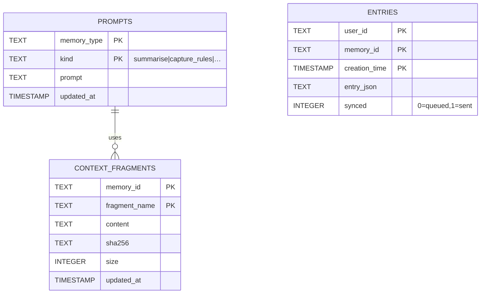

# SQLite Data Model – Experimental Archive

_(Moved from docs/design on 2025-06-19 after ADR-0020 deprecated the local mirror.  Retained here for future reference.)_

## Original Design

# SQLite Data Model – Synapse MCP Client

This document defines the relational schema for the **local** SQLite database used by the MCP side-car. All tables reside in **one** WAL-enabled database file (default: `~/.synapse/mcp.db`).

---
## ER Diagram



---
## Table Definitions

### `prompts`
Stores **override** prompt templates. If no row exists, the runtime falls back to the embedded default on disk.

```sql
CREATE TABLE IF NOT EXISTS prompts (
    memory_type TEXT NOT NULL,
    kind        TEXT NOT NULL,  -- 'summarise', 'capture_rules', …
    prompt      TEXT NOT NULL,  -- ≤ 2048 chars
    updated_at  TIMESTAMP DEFAULT CURRENT_TIMESTAMP,
    PRIMARY KEY (memory_type, kind)
);
```

* **memory_type**: Internal enum, e.g. `CUSTOMER_SUPPORT`, `CODING_ASSISTANT`.
* **kind**: Prompt purpose.
* **prompt**: The actual template text (override).

### `context_fragments`
Local cache for context files.

```sql
CREATE TABLE IF NOT EXISTS context_fragments (
    memory_id     TEXT NOT NULL,
    fragment_name TEXT NOT NULL,
    content       TEXT,
    sha256        TEXT,
    size          INTEGER,
    updated_at    TIMESTAMP,
    PRIMARY KEY (memory_id, fragment_name)
);
```

### `entries`
Optional local mirror / offline-queue for `add_entry` calls when backend is unreachable.

```sql
CREATE TABLE IF NOT EXISTS entries (
    user_id       TEXT NOT NULL,
    memory_id     TEXT NOT NULL,
    creation_time TIMESTAMP NOT NULL,
    entry_json    TEXT NOT NULL,   -- raw JSON payload
    synced        INTEGER DEFAULT 0,
    PRIMARY KEY (user_id, memory_id, creation_time)
);
```

* **synced**: 0 = queued locally, 1 = successfully pushed to backend.

---
## Pragmas & Settings

Executed at DB open:
```sql
PRAGMA foreign_keys = ON;
PRAGMA journal_mode = WAL;  -- enable concurrent reads while writing
PRAGMA synchronous = NORMAL;
```

---
## Migrations

* Schema version tracked via `PRAGMA user_version`.
* Each release ships incremental `schema_v<N>.sql` files.
* On start-up MCP applies pending migrations inside a single transaction.

---
## Future Extensions

* **policies** table can merge into `prompts` by adding a `category` column.
* Full-text index on `entries.entry_json` for offline search.
