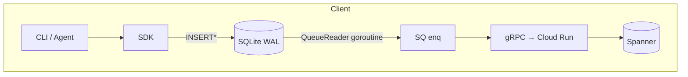

# Purpose
A fully-embedded SQLite database was originally proposed as a **local staging layer** for Synapse clients.  Although ADR-0020 moved the MVP to an in-memory Sharded Queue (SQ) plus direct cloud writes, the SQLite approach is preserved here for future evaluation (offline-first roadmap).

This document captures the **draft architecture, data-flow, and operational concerns** that informed the earlier design.

## 1  Why a Staging DB?
1. **Offline Write Buffer** – Persist writes while the device is offline / flaky.
2. **Crash-Safe Ordering** – WAL guarantees that queued writes survive process crash.
3. **Power-Loss Durability** – fsync after each transaction when on battery-critical devices.
4. **Rich Queries** – Allow local search / summarisation without hitting the cloud.

## 2  System Diagram

* `INSERT*` = inserts into `entries` (unsynced) + `pending_queue` tables in a single tx.
* `QueueReader` wakes on commit, reads oldest unsynced rows, enqueues into SQ (or sends direct).

## 3  Schema Overview (Δ over `sqlite_data_model.md`)
| Table | Purpose |
|-------|---------|
| `entries` | Durable buffer for `add_entry` JSON + sync flags |
| `pending_queue` | Row-per-operation FIFO; primary read source for QueueReader |
| `migrations` | Applied migration versions + checksum |
| `sync_state` | Last known **watermark** per memory for idempotent upload |

```sql
CREATE TABLE IF NOT EXISTS pending_queue (
    queue_id      INTEGER PRIMARY KEY AUTOINCREMENT,
    op_type       TEXT NOT NULL,      -- 'add_entry' | 'delete_entry' | …
    memory_id     TEXT NOT NULL,
    payload_json  TEXT NOT NULL,
    created_at    TIMESTAMP DEFAULT CURRENT_TIMESTAMP
);
```

### Transactional Insert Example
```sql
BEGIN;
INSERT INTO entries (...) VALUES (...);
INSERT INTO pending_queue(op_type, memory_id, payload_json) VALUES ('add_entry', ?, ?);
COMMIT;
```
`QueueReader` SELECTs oldest `queue_id`, enqueues job, marks row `processed_at` when acked by cloud.

## 4  Queue Processing Logic
1.  **Pop** oldest row (in tx).
2.  **Enqueue** job to SQ (respect per-memory FIFO).
3.  **On success** → DELETE row from `pending_queue` + set `synced=1` in `entries`.
4.  **On retryable failure** → exponential backoff, keep row.
5.  **On permanent failure** → mark `status='err'`, write to error log, surface metric.

## 5  Conflict & Duplication Handling
* **Idempotency-Key** stored inside `payload_json`; cloud side uses header to de-dupe.
* **Replay Protection**: `sync_state` keeps `(memory_id,last_creation_time)` watermark so the uploader can skip already-synced rows on cold-start scan.

## 6  Disk Usage & Pruning
| Limit | Value | Action |
|-------|-------|--------|
| DB size hard-cap | 500 MB | Oldest `entries` rows with `synced=1` are PURGED |
| Entry TTL | 30 days | Purge synced rows older than TTL |
| Fragment TTL | 7 days | Purge stale `context_fragments` |

Pruning runs in a low-priority goroutine, one chunk per minute.

## 7  Encryption (Future)
* **Option A**: `sqlcipher` for full-DB AES-256.
* **Option B**: OS keychain to encrypt row payloads.

## 8  Migration Strategy
* Use `PRAGMA user_version` and numbered `.sql` files.
* Migrations run under `BEGIN IMMEDIATE` to avoid reader starvation.
* Fallback to **read-only** mode if migration fails (user warned; writes disabled).

## 9  Failure Modes & Recovery
| Scenario | Behaviour |
|----------|-----------|
| Power loss mid-tx | WAL guarantees atomicity; queue resumes on restart |
| gRPC error | Row stays in queue; exponential retry |
| Disk full | Inserts fail; SDK bubbles `ErrDiskFull`; alerts user |
| Corruption | On `sqlite3_err_corrupt` open → backup db file; start fresh; unsynced data may be lost |

## 10  Metrics
* `sqlite_pending_rows` gauge.
* `sqlite_db_size_bytes` gauge.
* `sqlite_sync_latency_seconds` histogram (insert→delete).

## 11  Why Deferred?
* Proxying through SQ + cloud is simpler for MVP.
* Increases binary size and complexity.
* Requires conflict-resolution UX on sync errors.

## 12  Re-enable Checklist
1. Re-evaluate device storage constraints.
2. Decide on encryption approach.
3. Re-benchmark vs. pure-memory queue on mobile.
4. Re-run end-to-end failure injection tests. 