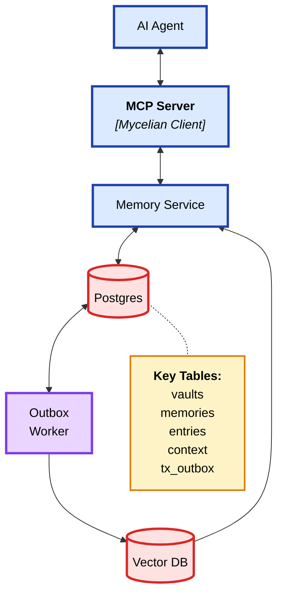

## Overview

This document presents a reliable, scalable and cost-effective memory architecture for AI agents. It provides the reader with an understanding of the problem and current solutions, then  defines the requirements, followed by insights on how the author came up with the design. This will lead us to high level design with some other options considered, followed by next steps.

## Problem
AI agents natively do not have reliable memory. They use an LLM as the decision maker with access to a set of tools to take actions, but LLMs fundamentally operate on transient context. Despite context windows of flagship models reaching 1-2 million tokens, each session starts completely blank. Moreover, models lose track of information buried in the middle of large contexts, making them unreliable even within sessions. They cannot learn from experience or accumulate knowledge over time. A customer support bot might handle thousands of users perfectly within each conversation, yet remembers none of them tomorrow. With reliable memory, these systems could continuously learn, adapt to each user, and become exponentially more valuable through every interaction.

Building persistent memory systems promises to fix this, but teams face overwhelming complexity: data pipelines, vector databases, retrieval algorithms, and state synchronization across services. Even well-built systems may fail because teams lack clarity on what success means for their specific use case. Standard benchmarks like LongMemEval might guide product selection, but they don't guarantee performance on actual production workloads at acceptable price points. What's needed is an opinionated memory solution that evolves with best practices, enabling AI agents to transform from stateless tools into learning systems that grow more valuable with every interaction.

## Current Solutions

Existing approaches to AI memory fall into three categories, each with fundamental limitations that prevent production-grade deployment at scale.

**Graph-based memory systems** achieve high precision by maintaining temporal knowledge graphs that explicitly model relationships between entities and events. While this novel approach excels at complex relationship queries, it introduces operational complexity and higher per-GB storage costs than traditional databases. Graphs will have a place in future memory architectures, but simpler approaches may also achieve high precision and recall without the associated complexity.

**Summarization-based approaches** process conversation history by periodically feeding recent turns to an LLM summarizer. The system extracts potential memories from these summaries, searches existing memory stores to check for duplicates, then either updates existing memories or creates new ones. While conceptually simple, this architecture suffers from compounding errors. Each summarization loses information, and the vector search used for duplicate detection operates below perfect precision and recall. These losses accumulate rapidly, making the systems unreliable for applications requiring factual consistency or long-term context retention.

**Closed proprietary platforms** from cloud vendors and model providers are rapidly emerging, with each building isolated memory solutions tightly coupled to their broader AI stacks. These platforms offer convenience and integration but come with tradeoffs around data ownership and portability. Organizations cannot self-host the infrastructure and face challenges extracting their data with sufficient fidelity to migrate between providers. Memory is often organized using proprietary schemas and relationships optimized for the platform's internal systems, which can be lost during export. For organizations prioritizing data sovereignty, multi-cloud strategies, or the option to bring capabilities in-house, these constraints present significant considerations when choosing a memory solution.

The rapid innovation in this space has created a clear need for an open-source memory platform built with production-grade engineering principles. Such a solution must be written in a language that enables both human developers and AI agents to reason about and extend the system, while providing the performance, durability, and operational simplicity required for enterprise deployment.

## Requirements

### Functional Requirements

* **Correct (P0)**: Maintain factual accuracy and data integrity.  
* **Memory Scoping Primitives (P0)**: Enable users to organize memories across organizations, projects, and vaults.  
* **High Performance (P1)**: Target strong precision and recall while maintaining cost efficiency.  
* **Adaptive (P2)**: Automatically consolidate and refine memories through usage patterns.  
* **Domain-Specific Metrics (P2)**: Enable measurement against customer-provided benchmarks.

### Non-functional Requirements

* **Simple**: Straightforward API for storing and retrieving memories.  
* **Cost-Effective**: Transparent pricing model without hidden charges.  
* **Reliable**: Architecture designed for high availability, durability, scalability and security.  
* **Open Source**: Full source code availability with self-hosting option.  
* **Opinionated Defaults**: Strong defaults with configuration options for common use cases.  
* **Observable**: Actionable metrics and logging for debugging and monitoring.

## Tenets

* **Simple over complex**: Choose straightforward solutions even if complex ones offer marginal gains  
* **User success over benchmarks**: Optimize for real user metrics, not synthetic leaderboards  
* **Opinionated over configurable**: Reduce architectural entropy, every option adds maintenance and bugs  
* **Production over demos**: Build for scale and reliability, not proof-of-concepts  
* **Ownership over lock-in**: Never compromise data portability for features or performance  
* **Correctness over speed**: Better to be slow and right than fast and wrong  
* **Transparency over magic**: Users should understand what the system does and why

## Mental Model

Large language models excel at maintaining context within a session but lose everything when that session ends. Rather than building yet another external memory system that tries to reconstruct what the LLM understands, Mycelian inverts the problem: we give LLMs a protocol to directly offload their working context. The agent extracts high-fidelity information at each conversational turn and periodically persists its complete contextual understanding. Users can customize the prompts to control how much and how often the agent stores information based on their specific use case. This creates a symbiotic relationship where the LLM does what it does best (understand and contextualize) while Mycelian provides what it lacks (durability and accumulation over time).

The system is fundamentally a log-structured memory architecture inspired by distributed systems principles \[1\]. Each memory consists of immutable entry logs (the facts) paired with context snapshots that evolve over time, though these contexts are sharded temporally and retrieved intelligently to maintain scalability. The architecture eliminates costly summarization steps and their opaque token costs by having agents annotate information inline during conversations, information they already process. It provides deterministic append-only storage that mirrors how LLMs naturally process information: accumulating facts while maintaining an evolving understanding. The result is a memory system where agents can finally learn from every interaction, building knowledge that persists and refines across sessions rather than starting fresh each time.

\[1\] [https://engineering.linkedin.com/distributed-systems/log-what-every-software-engineer-should-know-about-real-time-datas-unifying](https://engineering.linkedin.com/distributed-systems/log-what-every-software-engineer-should-know-about-real-time-datas-unifying)

## High Level Design

### System Architecture

### Core Architecture

Mycelian provides agents with durable working memory through a log-structured architecture. Each memory is an append-only stream of immutable entries paired with periodically persisted context snapshots. Agents explicitly determine what type of information to store (facts, preferences, observations) and organize it through vault-based scoping. Each vault represents a subject area containing a collection of purpose-specific memories \- one for facts, another for preferences, another for observations. This explicit organization makes memory transparent and debuggable rather than opaquely hidden inside the system. Agents control what to store and where, capturing exactly what they already process rather than requiring post-hoc reconstruction.

### Memory Lifecycle

Empty memories initialize with a default context placeholder, enabling immediate bootstrap. During conversations, agents evaluate each turn against capture rules and write relevant entries containing both raw text and compact summaries. Context snapshots persist periodically throughout conversations, not just at session end, preventing data loss from disconnections or crashes.

Context organization uses time-ordered shards instead of monolithic state. Recent shards maintain fresh details while older shards preserve high-fidelity facts. Though future summarizers could produce unified bootstrap contexts, shards remain the authoritative source for state reconstruction.

### Data Plane

The data plane maintains explicit simplicity. Memory Entry and Memory Context logs serve as storage truth. A cost-efficient CPU embedder processes summaries and raw text for vector index upserts supporting hybrid search. Deletions execute synchronously against storage with best-effort index removal, while an outbox-driven worker ensures eventual consistency. Retrieval surfaces both summaries and context shards for complete reconstruction. Optional client or server-side judges can validate results against raw storage, returning only query-relevant tokens.

### Retrieval and Reconstruction

New sessions begin with the agent fetching the latest context and retrieving top-k entries via search. Users can choose between sparse (keyword-only), dense (embedding-only), or hybrid search based on their performance and cost targets. The hybrid scorer blends both signals through a tunable alpha parameter, returning both high-signal entries and relevant context shards. Agents rebuild working context by combining latest state with retrieved facts, maintaining recency while preserving cross-session knowledge.

### Configuration

Prompts control capture and context formation. Context prompts specify preservation targets (participants, facts, decisions, timelines). Entry and summary prompts govern per-turn writes and summary conciseness. Configuration lives in `client/prompts/system/context_summary_rules.md` with defaults under `client/prompts/default/chat/`.

### Technology Choices

For Mycelian, the backend requires a robust, type-safe language that compiles to native binaries, runs efficiently in containers with fast bootstrap times and small memory footprint, and remains easy to understand and maintain. This eliminated interpreted languages like Python and JVM-based languages like Java. The choice between Rust and Go was difficult. After building prototypes in both, Go delivered better code generation throughput of production-quality code with AI coding tools. Its simpler syntax, strong server-side ecosystem, first-class concurrency primitives, and active Gopher community made it the right choice.

## Next Steps

Next steps are evaluating against LongMemEval and other benchmarks to establish baseline metrics and identify optimization opportunities. Native integrations with agentic orchestrators like LangGraph and CrewAI will follow, enabling teams to adopt Mycelian without rewriting existing architectures. Working with early users will then evolve memory patterns and refine defaults based on production workloads, with their feedback driving API improvements and domain-specific optimizations. Finally, enhanced scoping with full organizational hierarchies and project-based isolation will enable enterprise multi-team deployments with strict data boundaries and controlled cross-vault federation when needed.
