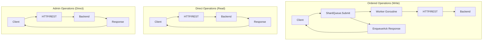

# Client API Concurrency Design

**Status**: Implemented  
**Author**: Development Team  
**Type**: Technical Implementation Document  

## Objective

Design and implement a client API that provides **deterministic ordering for write operations** while maintaining **high performance for read operations**. The API must support **offline resilience** and **concurrent access patterns** across different memory contexts without sacrificing consistency guarantees.

## Problem Statement

Memory-focused applications require predictable operation ordering to maintain coherent state. Without proper ordering:

- **Race conditions**: Concurrent writes to the same memory can arrive out of order
- **Read-after-write inconsistency**: Recent writes may not be visible in subsequent reads
- **Offline handling complexity**: Applications must manually manage retry logic and ordering
- **Debugging difficulty**: Non-deterministic operation sequences make issues hard to reproduce

**Scope**: Client-side API design for the Mycelian Memory SDK. Server-side implementation and global consistency are out of scope.

## Requirements

### Functional Requirements
- [x] **Per-memory write ordering**: All write operations for a single memory execute in FIFO order
- [x] **Cross-memory parallelism**: Different memories can have concurrent operations  
- [x] **Explicit consistency control**: Developers can wait for operation completion when needed

### Non-Functional Requirements
- **Responsiveness**: Users receive immediate acknowledgment without waiting for operation completion
- **Correctness**: Operations execute in the right order to maintain consistency and avoid race conditions

## High-Level Design

### Three-Class Concurrency Model

The client API divides all operations into three distinct execution classes:

| Class | Operations | Execution Path | Ordering Guarantee |
|-------|------------|----------------|-------------------|
| **Ordered (SQ)** | `AddEntry`, `PutContext`, `AwaitConsistency` | ShardQueue → 4 workers | FIFO per memory |
| **Eventual Reads** | `GetEntry`, `ListEntries`, `GetContext`, `Search` | Direct HTTP/REST | None (eventual) |
| **Admin Strong** | User: `CreateUser`, `GetUser`, `DeleteUser`<br/>Vault: `CreateVault`, `ListVaults`, `GetVault`, `DeleteVault`, `GetVaultByTitle`<br/>Memory: `CreateMemory`, `ListMemories`, `GetMemory`, `DeleteMemory`<br/>Entry: `DeleteEntry`<br/>Context: `DeleteContext`<br/>Prompts: `LoadDefaultPrompts` | Direct HTTP/REST | Backend-enforced |

### Key Design Decisions

**Decision 1: Ordered operations use async enqueue pattern**
- **Rationale**: Provides immediate acknowledgment while preserving ordering
- **Trade-offs**: Callers must handle eventual consistency explicitly

**Decision 2: Reads are direct and unordered**  
- **Rationale**: Maximum performance for read-heavy workloads
- **Trade-offs**: May see stale data until `AwaitConsistency()` called

**Decision 3: Admin operations bypass ordering queue**
- **Rationale**: Strong consistency from backend, no per-memory dependency
- **Trade-offs**: Higher latency but simpler mental model

### Data Flow



## Low-Level Design

### Component Architecture

```go
type Client struct {
    baseURL string
    http    *http.Client
    exec    executor        // ShardExecutor for ordered operations
}

type executor interface {
    Submit(context.Context, string, shardqueue.Job) error
    Stop()
}
```

### Ordered Operations Implementation

**Pattern**: Async enqueue with immediate acknowledgment

```go
func (c *Client) AddEntry(ctx context.Context, userID, vaultID, memID string, req AddEntryRequest) (*EnqueueAck, error) {
    // Create job that executes HTTP request
    job := job.New(func(jobCtx context.Context) error {
        // HTTP POST implementation
        return makeHTTPRequest(jobCtx, req)
    })
    
    // Submit to shard queue for ordering
    if err := c.exec.Submit(ctx, memID, job); err != nil {
        return nil, err
    }
    
    // Return immediately with enqueue acknowledgment
    return &EnqueueAck{MemoryID: memID, Status: "enqueued"}, nil
}
```

**Shard Selection**: Deterministic hash-based routing
```go
shard := fnv32a(memoryID) % cfg.Shards  // Default: 4 shards
```

**Operations**:
- `AddEntry(memoryID, entry)` → `*EnqueueAck`
- `PutContext(memoryID, context)` → `*EnqueueAck`  
- `AwaitConsistency(memoryID)` → blocks until queue empty

### Direct Operations Implementation

**Pattern**: Synchronous HTTP call with immediate response

```go
func (c *Client) GetEntry(ctx context.Context, userID, vaultID, memID, entryID string) (*Entry, error) {
    // Direct HTTP request
    url := fmt.Sprintf("%s/v0/users/%s/vaults/%s/memories/%s/entries/%s", 
                       c.baseURL, userID, vaultID, memID, entryID)
    resp, err := c.http.Get(url)
    // Handle response...
}
```

**Read Operations**:
- `GetEntry(entryID)` → `*Entry`
- `ListEntries(memoryID)` → `[]Entry`
- `GetContext(memoryID)` → `*Context`
- `Search(query)` → `*SearchResponse`

**Admin Operations**:
- `CreateMemory(req)` → `*Memory`
- `DeleteMemory(memoryID)` → `error`
- `CreateVault(req)` → `*Vault`
- All user/vault/memory CRUD operations

### Error Handling

**Async Operation Errors**:
```go
type EnqueueAck struct {
    MemoryID string `json:"memoryId"`
    Status   string `json:"status"`  // "enqueued"
}

// Submission errors
var ErrExecutorClosed = errors.New("shard executor closed")
var ErrQueueFull = errors.New("shard queue full")
```

**Execution Errors**: Handled by retry mechanism or error handler callback

**Sync Operation Errors**: Standard HTTP error codes translated to Go errors

### Consistency Control

**Await Mechanism**:
```go
func (c *Client) AwaitConsistency(ctx context.Context, memoryID string) error {
    // Submit no-op job and wait for completion
    done := make(chan struct{})
    job := job.New(func(context.Context) error {
        close(done)
        return nil
    })
    c.exec.Submit(ctx, memoryID, job)
    
    select {
    case <-done:
        return nil
    case <-ctx.Done():
        return ctx.Err()
    }
}
```

**Usage Pattern**:
```go
// Write operations
ack1, _ := client.AddEntry(ctx, userID, vaultID, memID, entry1)
ack2, _ := client.AddEntry(ctx, userID, vaultID, memID, entry2)

// Wait for writes to complete
client.AwaitConsistency(ctx, memID)

// Now reads see both entries
entries, _ := client.ListEntries(ctx, userID, vaultID, memID)
```

## Implementation Details

### Delete Operations Consistency
Delete operations (`DeleteEntry`, `DeleteContext`) use a hybrid approach to maintain consistency:
- **Direct HTTP execution** for immediate response and simplicity
- **Internal consistency guarantee** via `AwaitConsistency()` before deletion
- **Result**: Deletes never overtake pending writes while maintaining synchronous semantics for callers

### ShardQueue Configuration

Default configuration balances performance and resource usage:

```go
cfg := shardqueue.Config{
    Shards:         4,           // Worker goroutines
    QueueSize:      1000,        // Buffer per shard
    EnqueueTimeout: 100ms,       // Queue full timeout
    MaxAttempts:    8,           // Retry attempts
    BaseBackoff:    100ms,       // Initial retry delay
    MaxInterval:    20s,         // Max retry delay
}
```

**Environment overrides**: `SQ_SHARDS`, `SQ_QUEUE_SIZE`, etc.

### Retry and Back-Pressure

**Retry Logic**:
- Exponential backoff: 100ms → 200ms → 400ms → ... → 20s
- Context cancellation stops retries immediately
- Final failure calls error handler (if configured)

**Back-Pressure Handling**:
```go
err := client.AddEntry(ctx, userID, vaultID, memID, entry)
switch {
case errors.Is(err, shardqueue.ErrQueueFull):
    // Handle back-pressure: retry, drop, or return 429
case errors.Is(err, shardqueue.ErrExecutorClosed):
    // Shutdown in progress, stop submitting
case err != nil:
    // Other error (context cancellation, validation)
}
```

### Observability

**Prometheus Metrics**:
- `synapse_shardqueue_submissions_total{shard}` - Jobs enqueued
- `synapse_shardqueue_queue_full_total{shard}` - Back-pressure events  
- `synapse_shardqueue_run_duration_seconds{shard}` - Execution latency
- `synapse_shardqueue_queue_depth{shard}` - Current queue size

**Structured Logging**:
- Enqueue errors with memory ID context
- Retry attempts with backoff timing
- Graceful shutdown progress

## Performance Characteristics

### Latency Profile
- **Enqueue latency**: Sub-millisecond (channel send)
- **HTTP round-trip**: Network dependent  
- **Queue full timeout**: 100ms (configurable)

### Throughput Capacity
- **Bottleneck**: Backend API latency, not queue overhead
- **Scaling**: Linear with number of workers and unique memory IDs

### Memory Usage
- **Queue buffers**: Minimal (4 shards × 1000 job slots)
- **Worker overhead**: Standard goroutine overhead per worker
- **Total footprint**: Low memory usage for default configuration

## Testing Strategy

### Unit Testing
- Mock executor interface for API layer testing
- Isolated shardqueue behavior testing  
- Error condition coverage (timeouts, cancellation)

### Integration Testing
- Real backend connectivity with ordering verification
- Concurrent client scenarios across multiple memories
- Network failure and recovery testing

### Performance Testing
- Load testing with realistic memory access patterns
- Back-pressure behavior under sustained load
- Latency percentile measurement under various conditions

## Migration and Rollout

### Backward Compatibility
All existing synchronous APIs continue to work unchanged. New async APIs are additive.

### Feature Flags
Environment variable `MYCELIAN_FORCE_SYNC=true` disables async execution for debugging.

### Monitoring During Rollout
- Monitor `queue_full_total` for back-pressure issues
- Track `run_duration_seconds` percentiles for performance regression
- Alert on elevated error rates in retry loops

## Alternatives Considered

### Alternative 1: All Operations Synchronous
**Pros**: Simpler mental model, immediate error feedback  
**Cons**: Poor offline experience, head-of-line blocking, no ordering guarantees  
**Why rejected**: Doesn't solve core ordering problem, hurts offline UX

### Alternative 2: Global Operation Queue  
**Pros**: Simpler implementation, total ordering  
**Cons**: No parallelism, single point of contention, poor scalability  
**Why rejected**: Eliminates beneficial parallelism across memories

### Alternative 3: Client-Side SQLite Queue
**Pros**: Survives process restart, queryable state  
**Cons**: Complex dependency, disk I/O overhead, concurrency complexity  
**Why rejected**: Over-engineered for current requirements, deferred to future

## Future Considerations

**Planned Extensions**:
- Persistent queue backends for process restart survival  
- Batch operation APIs for high-throughput scenarios
- Cross-memory transaction support
- Priority queuing within shards

**Technical Debt**:
- Evaluate queue size auto-tuning based on load patterns  
- Add circuit breaker for backend fault tolerance
- Consider abstracting HTTP client for future transport flexibility

**Migration Paths**:
- Abstract executor interface enables queue backend changes
- Response types allow additional metadata without breaking changes
- Metric names support backend transport changes

## References

- ShardQueue Implementation Specification (`docs/specs/shardqueue.md`)
- Client concurrency model ADR (`docs-archive/client/adr/0020-client-concurrency-model.md`)  
- Context management ADR (`docs-archive/client/adr/0026-context-processing-update.md`)
- Delete operation ordering ADR (`docs-archive/client/adr/0009-delete-queue-integration.md`)

---

**Document Status**: This reflects the current implementation. Update when significant architectural changes occur.
