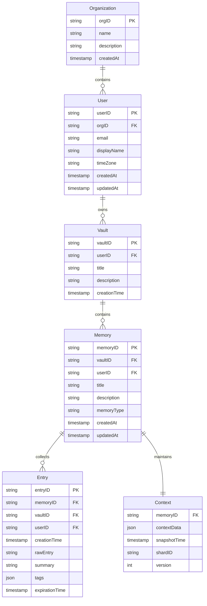

# Data Model

**Type**: System Documentation  
**Status**: Active  

## Overview

The Mycelian Memory system uses a hierarchical data model designed around **user isolation** and **flexible memory organization**. The model enables AI agents to maintain structured, searchable memories while providing clear boundaries for data access and organization.

## Conceptual Model

```
Organization (pending implementation)
└── User
    └── Vault (organizational container)
        └── Memory (collection of related events)
            ├── Entry (facts, observations, decisions)
            └── Context (evolving state, sharded over time)
```

The system is built on the principle that **agents choose** which memories to create in each vault, rather than having a single memory container for all types of information.

## Core Entities

### User
**Purpose**: Current top-level isolation boundary (Organization level pending implementation)  
**Scope**: All data is isolated by user - no cross-user access

- **ID**: Unique user identifier
- **Email**: Primary contact and authentication
- **DisplayName**: Human-readable name (optional)
- **TimeZone**: User's timezone for temporal operations
- **Timestamps**: Creation and update tracking

### Vault
**Purpose**: Organizational container for related memories  
**Scope**: User-owned containers that group memories by purpose, project, or domain

- **VaultID**: Unique identifier within user scope
- **UserID**: Owner reference (isolation boundary)
- **Title**: Human-readable vault name
- **Description**: Optional context about vault purpose
- **CreationTime**: When vault was established

**Examples**:
- "Work Projects" vault containing meeting and discussion memories
- "Personal Learning" vault with research and note memories
- "Customer Interactions" vault with conversation memories

### Memory
**Purpose**: Collection of related entries representing a coherent stream of events  
**Scope**: Specific memory within a vault, typed for agent behavior

- **MemoryID**: Unique identifier
- **VaultID**: Parent vault (organizational boundary)
- **UserID**: Owner reference (redundant for efficient queries)
- **Title**: Memory description
- **MemoryType**: Behavioral hint for agents
- **Timestamps**: Creation and modification tracking

**Memory Types**:
- **`conversation`**: Good for recording chats, discussions, notes etc.
- **Future types**: Will determine how agents interact with the memory

### Entry
**Purpose**: Individual events, facts, observations, or decisions  
**Scope**: Atomic unit of information within a memory

- **EntryID**: Unique identifier
- **MemoryID**: Parent memory
- **VaultID**: Parent vault (denormalized for efficiency)
- **UserID**: Owner (denormalized for isolation)
- **CreationTime**: When event occurred
- **RawEntry**: Original content as observed
- **Summary**: Optional condensed version
- **Tags**: Key-value metadata for classification
- **ExpirationTime**: Optional automatic cleanup

**Entry Examples**:
- Agent observed: "User decided to use PostgreSQL for the project database"
- Agent noted: "Meeting scheduled for Friday 2pm to discuss API design"
- Agent recorded: "User prefers morning meetings for better focus"

### Context (Conceptual)
**Purpose**: Evolving memory state that grows and gets sharded over time  
**Scope**: Associated with each memory, enables efficient context retrieval

- **Sharded storage**: Large contexts split for efficient access
- **Temporal organization**: Context evolution tracked over time
- **Selective retrieval**: Agent can fetch relevant context portions
- **Growth management**: Automatic sharding as context expands

## Entity Relationship Diagram



## Isolation Boundaries

### User-Level Isolation
- **Principle**: Complete data separation between users (Organization-level isolation pending)
- **Implementation**: All queries filtered by `userID`
- **Guarantee**: User A cannot access any data belonging to User B

### Vault-Level Organization
- **Principle**: Memories grouped by purpose or domain
- **Implementation**: Agents choose vault placement for new memories
- **Flexibility**: Cross-vault operations allowed within same user

### Memory-Level Coherence
- **Principle**: Entries within a memory form a coherent event stream
- **Implementation**: Memory provides context and scoping for entries
- **Behavior**: Memory type influences how agents interact with entries

## Memory Types

### Conversation Memories
- **Purpose**: Good for recording chats, discussions, notes etc.
- **Context Growth**: Evolves with ongoing conversations and interactions

### Future Memory Types
- **Extension Point**: New types will define specific agent interaction patterns
- **Examples**: Additional memory types can be added based on use case needs

## Context Management

### Growth Pattern
1. **Initial State**: Memory created with default context
2. **Entry Addition**: Each entry potentially updates memory context
3. **Context Evolution**: Context grows to reflect memory state
4. **Sharding Trigger**: Large contexts automatically split
5. **Selective Retrieval**: Agents fetch relevant context portions

### Sharding Strategy
- **Size-Based**: Split when context exceeds threshold
- **Time-Based**: Separate contexts by time periods
- **Topic-Based**: Shard by semantic clustering
- **Agent-Driven**: Agents request specific context ranges

### Retrieval Optimization
- **Relevance Scoring**: Return most pertinent context first
- **Incremental Loading**: Fetch additional context as needed
- **Cache Management**: Keep frequently accessed context available
- **Version Tracking**: Enable context evolution history

## Data Access Patterns

### Agent-Centric Operations
- **Create Memory**: Agent chooses vault and type
- **Add Entry**: Agent observes events and records them
- **Search Entries**: Agent finds relevant historical information
- **Retrieve Context**: Agent gets current memory state

### Query Isolation
```sql
-- All queries include user isolation
SELECT * FROM entries 
WHERE userID = ? AND vaultID = ? AND memoryID = ?

-- Cross-vault search within user scope
SELECT * FROM entries 
WHERE userID = ? AND rawEntry LIKE ?

-- Vault-level memory listing
SELECT * FROM memories 
WHERE userID = ? AND vaultID = ?
```

### Performance Considerations
- **Denormalized Foreign Keys**: `userID` repeated for efficient filtering
- **Composite Indexes**: Support common query patterns
- **Context Sharding**: Prevent large context retrieval bottlenecks
- **Entry Pagination**: Handle large memory entry sets

## Future Extensions

### Organization-Level Isolation
- **Organization Entity**: Top-level container for users (pending implementation)
- **Multi-Tenancy**: Organizations provide complete data isolation
- **User Management**: Users belong to organizations with role-based access
- **Billing Scope**: Organizations as billing and subscription units

### Multi-Agent Collaboration
- **Shared Vaults**: Multiple agents access same vault
- **Entry Attribution**: Track which agent created each entry
- **Context Merging**: Combine agent-specific contexts

### Advanced Memory Types
- **Workflow Memories**: Process and task tracking
- **Knowledge Memories**: Structured knowledge graphs
- **Temporal Memories**: Time-series event tracking

### Context Intelligence
- **Semantic Sharding**: AI-driven context organization
- **Predictive Loading**: Anticipate context needs
- **Context Summarization**: Automatic context condensation

## References

- **Client SDK**: `docs/designs/client-sdk.md`
- **Search Implementation**: Vector and keyword search over entries
- **Concurrency Model**: `docs/designs/client-api-concurrency.md`
- **MCP Integration**: `docs/designs/mcp-server.md`
