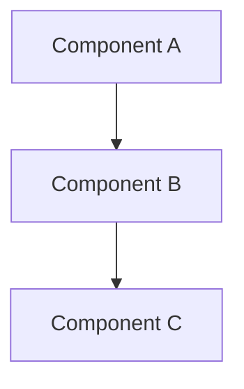
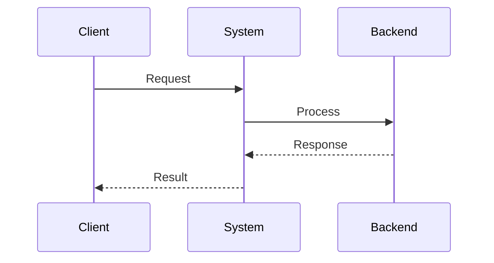

# [Title] Design Document

**Status**: [Draft | Review | Approved | Implemented]  
**Author**: [Name]  
**Reviewers**: [Names]  

_Design documents are targeted for developers familiar with the codebase. Write these using "On Writing Well" principles: clear, concise, factual, and free of unnecessary complexity._

## Objective

_What are we building and why? Single paragraph stating the goal clearly._

## Problem Statement

_What specific problem does this design solve? Include:_
- Current pain points or limitations
- Business/technical drivers for the change
- Scope boundaries (what's in/out of scope)

## Requirements

_Only include requirements that this design actually addresses. Focus on essential capabilities and core design goals._

### Functional Requirements
_What must the system do? List 3-5 core capabilities that drive the design._
- [x] **[Core capability 1]**: [Brief description]
- [x] **[Core capability 2]**: [Brief description]
- [x] **[Core capability 3]**: [Brief description]

### Non-Functional Requirements
_What are the essential design goals? Focus on 1-3 key qualities._
- **[Primary goal]**: [What the design optimizes for]
- **[Secondary goal]**: [What the design ensures]

## High-Level Design

_Architecture overview with key components and their interactions. Use Mermaid diagrams to visualize system architecture and data flow._

### System Architecture

_[Replace with actual architecture diagram and description of major components]_

### Key Design Decisions
- **Decision 1**: Rationale and trade-offs
- **Decision 2**: Rationale and trade-offs

### Data Flow

_[Replace with actual data flow diagram and description]_

## Low-Level Design

### Component Details
[Detailed specifications for each component]

### API Specifications
[Interface definitions, request/response formats]

### Data Models
[Schemas, validation rules, relationships]

### Error Handling
[Error types, propagation, recovery strategies]

### Security Considerations
[Authentication, authorization, encryption, audit]

## Implementation Plan

### Phases
1. **Phase 1**: [Description and deliverables]
2. **Phase 2**: [Description and deliverables]
3. **Phase 3**: [Description and deliverables]

### Dependencies
- [External dependencies and their requirements]
- [Internal component dependencies]

### Risks and Mitigations
| Risk | Impact | Probability | Mitigation |
|------|--------|-------------|------------|
| Risk 1 | High/Med/Low | High/Med/Low | Strategy |

## Testing Strategy

### Unit Testing
[Component-level testing approach]

### Integration Testing
[System-level testing approach]

### Performance Testing
[Load, stress, scalability testing]

## Monitoring and Observability

### Metrics
[Key performance indicators and operational metrics]

### Logging
[Log levels, structured logging, retention]

### Alerting
[SLIs, SLOs, error budgets, alert conditions]

## Alternatives Considered

### Alternative 1: [Name]
**Pros**: [Benefits]  
**Cons**: [Drawbacks]  
**Why rejected**: [Reasoning]

### Alternative 2: [Name]
**Pros**: [Benefits]  
**Cons**: [Drawbacks]  
**Why rejected**: [Reasoning]

## Future Considerations

_Planned extensions, technical debt, migration paths_

## References

- [Related ADRs, RFCs, specifications]
- [External documentation, standards]
- [Research papers, blog posts]

---

**Document Guidelines**:
- Write for developers familiar with the codebase
- Use clear, concise language following "On Writing Well" principles
- Prefer active voice and specific terminology
- Include code examples where helpful
- Update status and reviewers as document evolves
