# LangGraph-Based LongMemEval Benchmarker Design

## Overview

This document outlines the design for a LangGraph-based benchmarker to evaluate Mycelian Memory against the LongMemEval benchmark. The proposed architecture simplifies the current benchmarker by leveraging LangGraph's native MCP support and agent orchestration capabilities. It also serves as a proof-of-concept of how users will design memory management with Mycelian Memory.

## Problem Statement

The current benchmarker (`tools/benchmarker/`) has significant complexity:

- **SessionSimulator**: 2000+ lines managing conversation state, tool dispatch, bootstrap sequences
- **Custom state tracking**: Manual flags for bootstrap completion (`_boot_seen_get_context`, `_boot_seen_list_entries`)
- **Complex message routing**: Prefix-based routing (`benchmark_conversation:speaker_1`, `control:test_harness`)
- **Manual tool orchestration**: Direct Anthropic API calls with custom tool dispatch logic

LangGraph's native MCP support offers a cleaner alternative by handling state management, tool routing, and agent orchestration automatically.

## LongMemEval Requirements

Based on analysis of the LongMemEval benchmark:

### Dataset Characteristics
- **500 evaluation questions** testing 5 core memory abilities
- **Standard OpenAI format**: `{"role": "user/assistant", "content": "...", "has_answer": true}`
- **Three variants**: LongMemEval_S (~115k tokens), LongMemEval_M (~500 sessions), Oracle (evidence-only)
- **Session-based structure**: Multiple conversation sessions with temporal ordering

### Evaluation Pipeline
1. **Ingestion Phase**: Process haystack sessions to build memory
2. **Question Phase**: Ask questions requiring cross-session recall
3. **Evaluation Phase**: Compare responses against expected answers using GPT-4o judge

### Memory Abilities Tested
- Information Extraction
- Multi-Session Reasoning  
- Knowledge Updates
- Temporal Reasoning
- Abstention (identifying unanswerable questions)

## LangGraph Architecture Design

The memory agent builds its own independent context of the session without any lossy summarization. It uses this accumulated context to generate rich turn-by-turn summaries that are stored along with the evolving context. For this test we will be storing all turns in the memory but in-practice users can control what they want to persist based on their target precision and recall requirements.

## High Level Design

The proposed architecture uses a single end-to-end LangGraph workflow that orchestrates three specialized sub-workflow nodes: Ingestion, QA, and Evaluation. Each node delegates specific operations to either stateless processing components or stateful LangGraph agents. The **Mycelian Memory Agent** follows an observer pattern - it's a stateful LangGraph Agent that maintains session awareness and conversation history, observing conversations like an independent note-taker and building high-quality memories using the exact protocol encoded in `@client/prompts/system/context_summary_rules.md`. The **Conversation Processor** is a stateless LangGraph Node that orchestrates data flow, reading haystack sessions and calling the Memory Agent for each turn. This design eliminates the complex state management and tool dispatch logic of the current 2000+ line SessionSimulator, replacing it with LangGraph's native orchestration capabilities. 
### Core Components

#### Individual Workflow Components

 **Color Legend**

- 🔵 **LangGraph Nodes** (Light Blue): Stateless processing components
- 🟣 **LangGraph Agents** (Purple): Stateful conversation components  
- 🟢 **External Components** (Green): Data sources, services, outputs
- 🔄🔍📊 **LangGraph Workflows** (Subgraphs): Complete workflow orchestration

##### 1. Ingestion Workflow

```mermaid
graph TD
    A[Haystack Sessions] --> B[Conversation Processor Node]
    B --> C[Mycelian Memory Agent]
    C --> D[MCP Server]
    D --> E[Memory Stored]
    
    subgraph W1["🔄 Ingestion Workflow (LangGraph)"]
        B
    end
    
    classDef node fill:#e1f5fe,stroke:#0277bd,stroke-width:2px,color:#000
    classDef agent fill:#f3e5f5,stroke:#7b1fa2,stroke-width:2px,color:#000
    classDef external fill:#f1f8e9,stroke:#388e3c,stroke-width:2px,color:#000
    
    class B node
    class C agent
    class A,D,E external
```


##### 2. QA Workflow  

```mermaid
graph TD
    A[Question] --> B[QA Node]
    B --> C[QA Agent]
    C --> D[MCP Server]
    D --> E[Memory Retrieval]
    E --> C
    C --> F[Answer]
    
    subgraph W2["🔍 QA Workflow (LangGraph)"]
        B
        C
    end
    
    classDef node fill:#e1f5fe,stroke:#0277bd,stroke-width:2px,color:#000
    classDef agent fill:#f3e5f5,stroke:#7b1fa2,stroke-width:2px,color:#000
    classDef external fill:#f1f8e9,stroke:#388e3c,stroke-width:2px,color:#000
    
    class B node
    class C agent
    class A,D,E,F external
```


##### 3. Evaluation Workflow

```mermaid
graph TD
    A[Answer] --> B[Evaluation Node]
    C[Expected Answer] --> B
    B --> D[GPT-4o Judge]
    D --> E[Evaluation Score]
    
    subgraph W3["📊 Evaluation Workflow (LangGraph)"]
        B
    end
    
    classDef node fill:#e1f5fe,stroke:#0277bd,stroke-width:2px,color:#000
    classDef agent fill:#f3e5f5,stroke:#7b1fa2,stroke-width:2px,color:#000
    classDef external fill:#f1f8e9,stroke:#388e3c,stroke-width:2px,color:#000
    
    class B node
    class A,C,D,E external
```



##### 4. End-to-End LangGraph Workflow

```mermaid
graph TD
    A[LongMemEval Dataset] --> B[Setup Memory Node]
    B --> C[Ingestion Sub-Workflow Node]
    C --> D[QA Sub-Workflow Node] 
    D --> E[Evaluation Sub-Workflow Node]
    E --> F[Results Aggregation Node]
    F --> G[Benchmark Results]
    
    subgraph MW["🎯 End-to-End LangMemEval Workflow"]
        B
        C
        D
        E
        F
    end
    
    H["🔄 Ingestion Details:<br/>Conversation Processor<br/>→ Mycelian Memory Agent"]
    I["🔍 QA Details:<br/>QA Node<br/>→ QA Agent"]
    J["📊 Evaluation Details:<br/>Evaluation Node<br/>→ GPT-4o Judge"]
    
    C -.-> H
    D -.-> I
    E -.-> J
    
    classDef node fill:#e1f5fe,stroke:#0277bd,stroke-width:2px,color:#000
    classDef external fill:#f1f8e9,stroke:#388e3c,stroke-width:2px,color:#000
    classDef detail fill:#fafafa,stroke:#757575,stroke-width:1px,color:#000
    
    class B,C,D,E,F node
    class A,G external
    class H,I,J detail
```


## Implementation Details 

Following is the implementation ideas as of 08-26-2025. The developed langGraph based benchmarker code should be treated as source of truth. 
### 1. Mycelian Memory Agent

**Design Philosophy**: Observer agent that receives conversation turns and builds high-quality memories following the exact protocol in `@client/prompts/system/context_summary_rules.md`.

```python
from langchain_mcp_adapters.client import MultiServerMCPClient
from langgraph.prebuilt import create_react_agent

# MCP client configuration for memory operations
mcp_client = MultiServerMCPClient({
    "mycelian": {
        "url": "http://localhost:11546/mcp",
        "transport": "streamable_http"
    }
})

# Mycelian Memory Agent creation with MCP tools
memory_tools = await mcp_client.get_tools()

# Clean system prompt - relies on context_summary_rules.md protocol
mycelian_memory_agent_prompt = """
You are the Mycelian Memory Agent. Your sole responsibility is to produce high-quality memory and context following the exact protocol in context_summary_rules.md.

You will receive conversation turns in the format:
"Observe this turn: <role>: <content>"

Use the get_default_prompts tool to fetch the context_summary_rules.md protocol, then process each turn according to those rules.
"""

mycelian_memory_agent = create_react_agent(
    model="gpt-4o-mini-2024-07-18",
    tools=memory_tools,
    state_modifier=mycelian_memory_agent_prompt
)
```

### 2. End-to-End Workflow Implementation

```python
from langgraph.graph import StateGraph
from typing import TypedDict, List

# End-to-end benchmark state containing all necessary data
class LongMemEvalState(TypedDict):
    # Input data
    conversation_id: str
    haystack_sessions: List[List[dict]]
    question: str
    expected_answer: str
    memory_id: str
    
    # Intermediate results
    ingestion_complete: bool
    qa_response: str
    
    # Final results
    evaluation_score: float
    benchmark_results: dict

def create_longmemeval_end_to_end_workflow():
    workflow = StateGraph(LongMemEvalState)
    
    # End-to-end workflow nodes
    workflow.add_node("setup", setup_memory_node)
    workflow.add_node("ingestion", ingestion_sub_workflow_node)
    workflow.add_node("qa", qa_sub_workflow_node)
    workflow.add_node("evaluation", evaluation_sub_workflow_node)
    workflow.add_node("results", results_aggregation_node)
    
    # Sequential flow
    workflow.add_edge("setup", "ingestion")
    workflow.add_edge("ingestion", "qa")
    workflow.add_edge("qa", "evaluation") 
    workflow.add_edge("evaluation", "results")
    
    workflow.set_entry_point("setup")
    workflow.set_finish_point("results")
    
    return workflow.compile()

# Sub-workflow node implementations
async def ingestion_sub_workflow_node(state: LongMemEvalState):
    """Calls the ingestion sub-workflow"""
    await conversation_processor_node(state)
    state["ingestion_complete"] = True
    return state

async def qa_sub_workflow_node(state: LongMemEvalState):
    """Calls the QA sub-workflow"""
    updated_state = await qa_agent_node(state)
    state["qa_response"] = updated_state["response"]
    return state

async def evaluation_sub_workflow_node(state: LongMemEvalState):
    """Calls the evaluation sub-workflow"""
    score = await evaluation_node(state)
    state["evaluation_score"] = score
    return state

# Workflow orchestration
def run_longmemeval_benchmark():
    """Process each LongMemEval conversation through end-to-end workflow"""
    end_to_end_workflow = create_longmemeval_end_to_end_workflow()
    results = []
    
    for conversation in longmemeval_dataset:
        result = await end_to_end_workflow.ainvoke({
            "conversation_id": conversation.id,
            "haystack_sessions": conversation.sessions,
            "question": conversation.question,
            "expected_answer": conversation.answer,
            "memory_id": create_memory_id(),
            "ingestion_complete": False,
            "qa_response": "",
            "evaluation_score": 0.0,
            "benchmark_results": {}
        })
        results.append(result["benchmark_results"])
    
    return aggregate_benchmark_results(results)
```

### 3. Conversation Processor Node

```python
async def conversation_processor_node(state: LongMemEvalState):
    """Process haystack sessions and send turns to memory agent - Option 1: Non-LLM"""
    
    # Initialize memory session
    init_message = f"""
    Initialize memory session for conversation {state['conversation_id']}.
    Memory ID: {state['memory_id']}
    
    Follow bootstrap sequence from context_summary_rules.md.
    """
    
    await mycelian_memory_agent.ainvoke({
        "messages": [{"role": "user", "content": init_message}]
    })
    
    # Process each session and turn
    for session_idx, session in enumerate(state["haystack_sessions"]):
        # Send session start signal
        session_message = f"Starting session {session_idx + 1} of conversation {state['conversation_id']}"
        
        await mycelian_memory_agent.ainvoke({
            "messages": [{"role": "user", "content": session_message}]
        })
        
        # Send each turn to Mycelian Memory Agent
        for turn in session:
            turn_message = f"Observe this turn: {turn['role']}: {turn['content']}"
            
            await mycelian_memory_agent.ainvoke({
                "messages": [{"role": "user", "content": turn_message}]
            })
    
    # Signal end of conversation
    end_message = f"End of conversation {state['conversation_id']}. Finalize memory session."
    
    await mycelian_memory_agent.ainvoke({
        "messages": [{"role": "user", "content": end_message}]
    })
    
    return state

# Alternative Option 2: Cheap LLM Processor  
conversation_reader = create_react_agent(
    model="claude-3-haiku-20240307",
    system="Read conversation sessions and send individual turns to the Mycelian Memory Agent for processing."
)
```


### 4. Evaluation Node

```python
async def evaluation_node(state: LongMemEvalState):
    """Use GPT-4o judge to evaluate QA response against expected answer"""
    
    # Create evaluation client
    evaluation_client = OpenAI(api_key=os.getenv('OPENAI_API_KEY'))
    
    # Get evaluation prompt from LongMemEval's evaluate_qa.py logic
    question_type = determine_question_type(state["question"])
    abstention = "_abs" in state["conversation_id"]
    
    eval_prompt = get_anscheck_prompt(
        task=question_type,
        question=state["question"],
        answer=state["expected_answer"], 
        response=state["qa_response"],
        abstention=abstention
    )
    
    # Call GPT-4o judge
    completion = evaluation_client.chat.completions.create(
        model="gpt-4o-2024-08-06",
        messages=[{"role": "user", "content": eval_prompt}],
        temperature=0,
        max_tokens=10
    )
    
    eval_response = completion.choices[0].message.content.strip()
    score = 1.0 if 'yes' in eval_response.lower() else 0.0
    
    state["evaluation_score"] = score
    return state
```

### 5. Setup and Results Nodes

```python
async def setup_memory_node(state: LongMemEvalState):
    """Initialize memory for the conversation"""
    # Create vault if needed
    vault_id = await create_or_get_vault("longmemeval-benchmark")
    
    # Create memory for this conversation
    memory_id = await create_memory(
        vault_id=vault_id,
        title=f"conversation-{state['conversation_id']}",
        memory_type="chat"
    )
    
    state["memory_id"] = memory_id
    return state

async def results_aggregation_node(state: LongMemEvalState):
    """Aggregate final benchmark results"""
    state["benchmark_results"] = {
        "conversation_id": state["conversation_id"],
        "question_type": determine_question_type(state["question"]),
        "score": state["evaluation_score"],
        "qa_response": state["qa_response"],
        "expected_answer": state["expected_answer"]
    }
    return state
```

### 6. QA Agent Node

```python
async def qa_agent_node(state: LongMemEvalState):
    """Separate QA agent uses stored memories to answer questions"""
    
    # Create QA agent separate from Mycelian Memory Agent
    qa_agent = create_react_agent(
        model="gpt-4o-2024-08-06",  # High-capability model for reasoning
        tools=await mcp_client.get_tools(),
        system="""
        You are a question answering agent. Use stored memories to answer questions.
        
        For each question:
        1. Call get_context() to retrieve current context
        2. Call list_entries(limit=10) to review recent memories  
        3. Call search_memories() with the question to find relevant information
        4. Provide your answer based on retrieved information
        5. If insufficient information, clearly state this for abstention
        """
    )
    
    qa_message = f"""
    Answer this question using stored memories:
    {state['question']}
    
    Memory ID: {state['memory_id']}
    """
    
    response = await qa_agent.ainvoke({
        "messages": [{"role": "user", "content": qa_message}]
    })
    
    # Extract the final answer
    state["response"] = response["messages"][-1]["content"]
    
    return state
```


