# LangGraph-Based LongMemEval Benchmarker Design

## Overview

This document outlines the design for a LangGraph-based benchmarker to evaluate Mycelian Memory against the LongMemEval benchmark. The proposed architecture simplifies the current benchmarker by leveraging LangGraph's native MCP support and agent orchestration capabilities. It also serves as a proof-of-concept of how users will design memory management with Mycelian Memory.

**Last Updated**: August 2024 - Refined with architectural decisions

## Problem Statement

The current benchmarker (`tools/benchmarker/`) has significant complexity:

- **SessionSimulator**: 2000+ lines managing conversation state, tool dispatch, bootstrap sequences
- **Custom state tracking**: Manual flags for bootstrap completion (`_boot_seen_get_context`, `_boot_seen_list_entries`)
- **Complex message routing**: Prefix-based routing (`benchmark_conversation:speaker_1`, `control:test_harness`)
- **Manual tool orchestration**: Direct Anthropic API calls with custom tool dispatch logic

LangGraph's native MCP support offers a cleaner alternative by handling state management, tool routing, and agent orchestration automatically.

## LongMemEval Requirements

Based on analysis of the LongMemEval benchmark:

### Dataset Characteristics
- **500 evaluation questions** testing 5 core memory abilities
- **Standard OpenAI format**: `{"role": "user/assistant", "content": "...", "has_answer": true}`
- **Three variants**: LongMemEval_S (~115k tokens), LongMemEval_M (~500 sessions), Oracle (evidence-only)
- **Session-based structure**: Multiple conversation sessions with temporal ordering

### Evaluation Pipeline
1. **Ingestion Phase**: Process haystack sessions to build memory
2. **Question Phase**: Ask questions requiring cross-session recall
3. **Evaluation Phase**: Compare responses against expected answers using GPT-4o judge

### Memory Abilities Tested
- Information Extraction
- Multi-Session Reasoning  
- Knowledge Updates
- Temporal Reasoning
- Abstention (identifying unanswerable questions)

## LangGraph Architecture Design

The memory agent builds its own independent context of the session without any lossy summarization. It uses this accumulated context to generate rich turn-by-turn summaries that are stored along with the evolving context. For this test we will be storing all turns in the memory but in-practice users can control what they want to persist based on their target precision and recall requirements.

## High Level Design

The proposed architecture uses a single end-to-end LangGraph workflow that orchestrates three specialized sub-workflow nodes: Ingestion, QA, and Evaluation. Each node delegates specific operations to either stateless processing components or stateful LangGraph agents. 

### Key Architectural Decisions

1. **Memory Agent Lifecycle**: A new Memory Agent instance is created **per session** (not per conversation). This mirrors production usage where agents don't persist indefinitely. Cross-session continuity is provided by Mycelian Memory through the bootstrap protocol.

2. **Prompt Loading**: Context rules and prompts are **pre-loaded once** during Memory Agent initialization and embedded in the system prompt, avoiding repeated tool calls per turn.

3. **Communication Pattern**: Memory Agent is wrapped in a dedicated LangGraph Node for better observability, error handling, and state management.

4. **Vault Organization**: One vault per host/environment (e.g., "sam-macbook-longmemeval-vault"), reused across all benchmark runs on that host.

5. **Error Handling**: Retry with exponential backoff for transient failures, with special handling for Bedrock throttling.

6. **QA Strategy**: Single `search_memories()` call returns both relevant entries and context shards, eliminating multiple tool calls.

The **Mycelian Memory Agent** follows an observer pattern - it's a stateful LangGraph Agent that maintains session awareness within its session, observing conversations like an independent note-taker and building high-quality memories using the exact protocol encoded in `@client/prompts/system/context_summary_rules.md`. The **Conversation Processor** is a stateful orchestrator that manages Memory Agent lifecycle, creating a new instance for each session. This design eliminates the complex state management and tool dispatch logic of the current 2000+ line SessionSimulator, replacing it with LangGraph's native orchestration capabilities. 
### Core Components

#### Individual Workflow Components

 **Color Legend**

- 🔵 **LangGraph Nodes** (Light Blue): Stateless processing components
- 🟣 **LangGraph Agents** (Purple): Stateful conversation components  
- 🟢 **External Components** (Green): Data sources, services, outputs
- 🔄🔍📊 **LangGraph Workflows** (Subgraphs): Complete workflow orchestration

##### 1. Ingestion Workflow

```mermaid
graph TD
    A[Haystack Sessions] --> B[Conversation Processor Node]
    B --> C[Mycelian Memory Agent]
    C --> D[MCP Server]
    D --> E[Memory Stored]
    
    subgraph W1["🔄 Ingestion Workflow (LangGraph)"]
        B
    end
    
    classDef node fill:#e1f5fe,stroke:#0277bd,stroke-width:2px,color:#000
    classDef agent fill:#f3e5f5,stroke:#7b1fa2,stroke-width:2px,color:#000
    classDef external fill:#f1f8e9,stroke:#388e3c,stroke-width:2px,color:#000
    
    class B node
    class C agent
    class A,D,E external
```


##### 2. QA Workflow  

```mermaid
graph TD
    A[Question] --> B[QA Node]
    B --> C[QA Agent]
    C --> D[MCP Server]
    D --> E[Memory Retrieval]
    E --> C
    C --> F[Answer]
    
    subgraph W2["🔍 QA Workflow (LangGraph)"]
        B
        C
    end
    
    classDef node fill:#e1f5fe,stroke:#0277bd,stroke-width:2px,color:#000
    classDef agent fill:#f3e5f5,stroke:#7b1fa2,stroke-width:2px,color:#000
    classDef external fill:#f1f8e9,stroke:#388e3c,stroke-width:2px,color:#000
    
    class B node
    class C agent
    class A,D,E,F external
```


##### 3. Evaluation Workflow

```mermaid
graph TD
    A[Answer] --> B[Evaluation Node]
    C[Expected Answer] --> B
    B --> D[GPT-4o Judge]
    D --> E[Evaluation Score]
    
    subgraph W3["📊 Evaluation Workflow (LangGraph)"]
        B
    end
    
    classDef node fill:#e1f5fe,stroke:#0277bd,stroke-width:2px,color:#000
    classDef agent fill:#f3e5f5,stroke:#7b1fa2,stroke-width:2px,color:#000
    classDef external fill:#f1f8e9,stroke:#388e3c,stroke-width:2px,color:#000
    
    class B node
    class A,C,D,E external
```



##### 4. End-to-End LangGraph Workflow

```mermaid
graph TD
    A[LongMemEval Dataset] --> B[Setup Memory Node]
    B --> C[Ingestion Sub-Workflow Node]
    C --> D[QA Sub-Workflow Node] 
    D --> E[Evaluation Sub-Workflow Node]
    E --> F[Results Aggregation Node]
    F --> G[Benchmark Results]
    
    subgraph MW["🎯 End-to-End LangMemEval Workflow"]
        B
        C
        D
        E
        F
    end
    
    H["🔄 Ingestion Details:<br/>Conversation Processor<br/>→ Mycelian Memory Agent"]
    I["🔍 QA Details:<br/>QA Node<br/>→ QA Agent"]
    J["📊 Evaluation Details:<br/>Evaluation Node<br/>→ GPT-4o Judge"]
    
    C -.-> H
    D -.-> I
    E -.-> J
    
    classDef node fill:#e1f5fe,stroke:#0277bd,stroke-width:2px,color:#000
    classDef external fill:#f1f8e9,stroke:#388e3c,stroke-width:2px,color:#000
    classDef detail fill:#fafafa,stroke:#757575,stroke-width:1px,color:#000
    
    class B,C,D,E,F node
    class A,G external
    class H,I,J detail
```


## Implementation Details 

Following is the implementation ideas as of 08-26-2025. The developed langGraph based benchmarker code should be treated as source of truth. 
### 1. Mycelian Memory Agent

**Design Philosophy**: Observer agent that receives conversation turns and builds high-quality memories following the exact protocol in `@client/prompts/system/context_summary_rules.md`. Created fresh for each session with prompts pre-loaded.

```python
async def create_memory_agent(vault_id: str, memory_id: str, mcp_client):
    """Create a Memory Agent with pre-loaded prompts for a session."""
    
    # Fetch prompts ONCE during initialization
    prompts_data = await mcp_client.call_tool(
        "get_default_prompts", 
        {"memory_type": "chat"}
    )
    
    # Get MCP tools
    memory_tools = await mcp_client.get_tools()
    
    # Build system prompt with pre-loaded rules
    system_prompt = f"""You are the Mycelian Memory Agent.

Here are the context_summary_rules you must follow:
{prompts_data['context_summary_rules']}

Context Template:
{prompts_data['templates']['context_prompt']}

Entry Capture Rules:
{prompts_data['templates']['entry_capture_prompt']}

Vault ID: {vault_id}
Memory ID: {memory_id}

You will receive conversation turns in the format:
"Observe this turn: <role>: <content>"

Process each turn according to the rules above."""

    # Create prompt function with embedded rules
    def prompt(state):
        return [{"role": "system", "content": system_prompt}] + state["messages"]
    
    return create_react_agent(
        model="gpt-4o-mini-2024-07-18",
        tools=memory_tools,
        prompt=prompt  # Rules pre-loaded, no runtime fetching needed
    )
```

### 2. End-to-End Workflow Implementation

```python
from langgraph.graph import StateGraph
from typing import TypedDict, List

# End-to-end benchmark state containing all necessary data
class LongMemEvalState(TypedDict):
    # Input data
    conversation_id: str
    haystack_sessions: List[List[dict]]
    question: str
    expected_answer: str
    
    # Workflow management
    run_id: str  # Generated at workflow level
    vault_id: str  # Set by setup node
    memory_id: str  # Set by setup node
    mcp_client: Any  # MCP client instance
    
    # Intermediate results
    ingestion_complete: bool
    qa_response: str
    
    # Final results
    evaluation_score: float
    benchmark_results: dict
    error: Optional[str]  # Error tracking

def create_longmemeval_end_to_end_workflow():
    workflow = StateGraph(LongMemEvalState)
    
    # End-to-end workflow nodes
    workflow.add_node("setup", setup_memory_node)
    workflow.add_node("ingestion", ingestion_sub_workflow_node)
    workflow.add_node("qa", qa_sub_workflow_node)
    workflow.add_node("evaluation", evaluation_sub_workflow_node)
    workflow.add_node("results", results_aggregation_node)
    
    # Sequential flow
    workflow.add_edge("setup", "ingestion")
    workflow.add_edge("ingestion", "qa")
    workflow.add_edge("qa", "evaluation") 
    workflow.add_edge("evaluation", "results")
    
    workflow.set_entry_point("setup")
    workflow.set_finish_point("results")
    
    return workflow.compile()

# Sub-workflow node implementations
async def ingestion_sub_workflow_node(state: LongMemEvalState):
    """Calls the ingestion sub-workflow"""
    await conversation_processor_node(state)
    state["ingestion_complete"] = True
    return state

async def qa_sub_workflow_node(state: LongMemEvalState):
    """Calls the QA sub-workflow"""
    updated_state = await qa_agent_node(state)
    state["qa_response"] = updated_state["response"]
    return state

async def evaluation_sub_workflow_node(state: LongMemEvalState):
    """Calls the evaluation sub-workflow"""
    score = await evaluation_node(state)
    state["evaluation_score"] = score
    return state

# Workflow orchestration
async def run_longmemeval_benchmark(dataset, config):
    """Process each LongMemEval conversation through end-to-end workflow"""
    import uuid
    from langchain_mcp_adapters.client import MultiServerMCPClient
    
    # Generate run_id once for entire benchmark
    run_id = str(uuid.uuid4())[:8]
    
    # Initialize MCP client once
    mcp_client = MultiServerMCPClient({
        "mycelian": {
            "url": config.mcp_url,
            "transport": config.mcp_transport
        }
    })
    
    end_to_end_workflow = create_longmemeval_end_to_end_workflow()
    results = []
    
    for conversation in dataset:
        result = await end_to_end_workflow.ainvoke({
            "conversation_id": conversation["question_id"],
            "haystack_sessions": conversation["haystack_sessions"],
            "question": conversation["question"],
            "expected_answer": conversation["answer"],
            "run_id": run_id,  # Same for all conversations
            "mcp_client": mcp_client,
            "vault_id": "",  # Will be set by setup node
            "memory_id": "",  # Will be set by setup node
            "ingestion_complete": False,
            "qa_response": "",
            "evaluation_score": 0.0,
            "benchmark_results": {},
            "error": None
        })
        results.append(result["benchmark_results"])
    
    return aggregate_benchmark_results(results)
```

### 3. Conversation Processor Node (Stateful Orchestrator)

```python
async def conversation_processor_node(state: LongMemEvalState):
    """Stateful orchestrator that manages Memory Agent lifecycle per session."""
    
    vault_id = state["vault_id"]
    memory_id = state["memory_id"]
    mcp_client = state["mcp_client"]
    
    # Process each session with a fresh Memory Agent
    for session_idx, session in enumerate(state["haystack_sessions"]):
        # Create new Memory Agent for THIS session
        memory_agent = await create_memory_agent(vault_id, memory_id, mcp_client)
        
        # Memory Agent bootstraps from Mycelian (get_context, list_entries)
        # This provides continuity from previous sessions
        
        # Process all turns in this session
        for turn in session:
            turn_message = f"Observe this turn: {turn['role']}: {turn['content']}"
            
            # Delegate to Memory Agent Node for error handling
            await memory_agent_node({
                "agent": memory_agent,
                "message": turn_message,
                "session_idx": session_idx
            })
        
        # Finalize session - ensure context is persisted
        await memory_agent_node({
            "agent": memory_agent,
            "message": f"End of session {session_idx + 1}. Finalize memory.",
            "finalize": True
        })
        
        # Memory Agent instance is discarded
        # Next session gets fresh agent that bootstraps from updated memory
    
    state["ingestion_complete"] = True
    return state

async def memory_agent_node(agent_state):
    """Wrapper node for Memory Agent with error handling."""
    max_retries = 3
    backoff = 1.0
    
    for attempt in range(max_retries):
        try:
            response = await agent_state["agent"].ainvoke({
                "messages": [{"role": "user", "content": agent_state["message"]}]
            }, config={"recursion_limit": 100})
            
            agent_state["response"] = response
            return agent_state
            
        except ThrottlingException as e:
            if attempt == max_retries - 1:
                agent_state["error"] = f"Throttled after {max_retries} attempts"
                return agent_state
            
            # Bedrock needs longer backoff
            wait_time = backoff * (2 if "bedrock" in str(e) else 1)
            await asyncio.sleep(wait_time)
            backoff *= 2
        except RecursionLimitError:
            # Try once with higher limit
            if attempt == 0:
                config["recursion_limit"] = 150
            else:
                raise
```


### 4. Evaluation Node

```python
async def evaluation_node(state: LongMemEvalState):
    """Use GPT-4o judge to evaluate QA response against expected answer"""
    
    # Create evaluation client
    evaluation_client = OpenAI(api_key=os.getenv('OPENAI_API_KEY'))
    
    # Get evaluation prompt from LongMemEval's evaluate_qa.py logic
    question_type = determine_question_type(state["question"])
    abstention = "_abs" in state["conversation_id"]
    
    eval_prompt = get_anscheck_prompt(
        task=question_type,
        question=state["question"],
        answer=state["expected_answer"], 
        response=state["qa_response"],
        abstention=abstention
    )
    
    # Call GPT-4o judge
    completion = evaluation_client.chat.completions.create(
        model="gpt-4o-2024-08-06",
        messages=[{"role": "user", "content": eval_prompt}],
        temperature=0,
        max_tokens=10
    )
    
    eval_response = completion.choices[0].message.content.strip()
    score = 1.0 if 'yes' in eval_response.lower() else 0.0
    
    state["evaluation_score"] = score
    return state
```

### 5. Setup and Results Nodes

```python
async def setup_memory_node(state: LongMemEvalState):
    """Initialize vault and memory for the conversation."""
    import socket
    
    # Get or create vault per host/environment
    hostname = socket.gethostname()
    vault_name = f"{hostname}-longmemeval-vault"
    
    # Use get-or-create pattern for idempotency
    vault_id = await create_or_get_vault(vault_name)
    
    # Generate run_id at workflow level (passed in state)
    run_id = state["run_id"]  
    
    # Create memory for this conversation + run
    memory_title = f"conv-{state['conversation_id']}-run-{run_id}"
    memory_id = await create_memory(
        vault_id=vault_id,
        title=memory_title,
        memory_type="chat"
    )
    
    state["vault_id"] = vault_id
    state["memory_id"] = memory_id
    return state

async def results_aggregation_node(state: LongMemEvalState):
    """Aggregate final benchmark results."""
    state["benchmark_results"] = {
        "conversation_id": state["conversation_id"],
        "run_id": state["run_id"],
        "question_type": determine_question_type(state["question"]),
        "score": state["evaluation_score"],
        "qa_response": state["qa_response"],
        "expected_answer": state["expected_answer"],
        "memory_id": state["memory_id"]
    }
    return state
```

### 6. QA Agent Node (Simplified)

```python
async def qa_agent_node(state: LongMemEvalState):
    """QA agent uses search_memories() to answer questions efficiently."""
    
    # Create QA agent with simplified approach
    qa_agent = create_react_agent(
        model="gpt-4o-2024-08-06",  # High-capability model for reasoning
        tools=await state["mcp_client"].get_tools(),
        system="""
        You are a question answering agent. Use stored memories to answer questions.
        
        To answer a question:
        1. Call search_memories() with the question - this returns:
           - Relevant entries (ranked by similarity)
           - Best matching context shard
           - Latest context
        2. Form your answer based on the search results
        3. If insufficient information found, clearly state "I don't have enough information to answer this question"
        
        Be precise and only use information from the search results.
        """
    )
    
    qa_message = f"""
    Answer this question using stored memories:
    {state['question']}
    
    Memory ID: {state['memory_id']}
    Vault ID: {state['vault_id']}
    """
    
    try:
        response = await qa_agent.ainvoke({
            "messages": [{"role": "user", "content": qa_message}]
        }, config={"recursion_limit": 50})  # Lower limit for QA
        
        # Extract the final answer
        state["qa_response"] = response["messages"][-1]["content"]
    except Exception as e:
        # Handle search failures gracefully
        state["qa_response"] = f"Error during search: {str(e)}"
        state["error"] = str(e)
    
    return state
```


